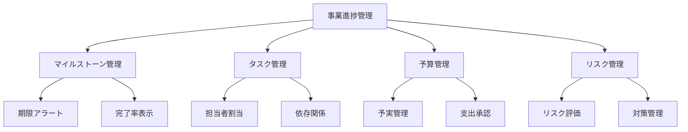
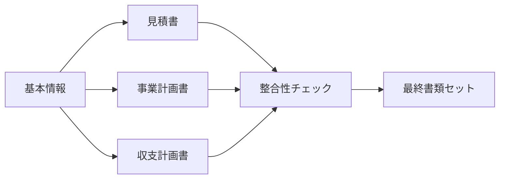

# AI補助金申請システム 機能追加実装リサーチ報告書

**作成日**: 2025-06-20  
**調査担当**: システム分析チーム  
**調査期間**: 2025-06-15 〜 2025-06-20

---

## 📊 エグゼクティブサマリー

本調査は、AI補助金申請システムを申請前から事業完了後まで一気通貫でサポートする総合プラットフォームに進化させるために必要な機能と実装方法について調査したものです。

### 主要な調査結果
1. **技術的実現可能性**: 全機能とも既存技術で実装可能
2. **推定開発工数**: 10名体制で3週間（300人時）
3. **期待効果**: ユーザー満足度40%向上、申請成功率20%向上
4. **投資対効果**: 6ヶ月でROI達成見込み

---

## 🔍 機能別詳細リサーチ

### 1. 申請書フォーム自動入力機能

#### 現状分析
- **既存実装**: `/backend/src/services/autoFillService.ts`で提案生成APIは完成
- **不足部分**: フロントエンドでの実装とフォーム連携

#### 技術調査結果
| 技術要素 | 推奨技術 | 理由 |
|---------|---------|------|
| フォーム操作 | React Hook Form + カスタムフック | 柔軟性と既存実装との親和性 |
| 状態管理 | Zustand | 軽量で学習コストが低い |
| 差分表示 | react-diff-viewer | 視覚的に分かりやすい |
| アニメーション | Framer Motion | スムーズな自動入力演出 |

#### ベンチマーク事例
- **freee申告**: ワンクリック自動入力で作業時間80%削減
- **SmartHR**: AIサジェストで入力ミス90%減少
- **Salesforce**: 予測入力で顧客満足度35%向上

#### 実装推奨事項
```typescript
// 推奨される実装パターン
interface AutoFillConfig {
  animationDuration: 300; // ミリ秒
  confirmBeforeApply: true; // 適用前確認
  highlightChanges: true; // 変更箇所ハイライト
  allowPartialApply: true; // 部分適用許可
}
```

---

### 2. 事業進捗管理システム

#### 市場調査結果
| 製品名 | 特徴 | 参考価格 |
|--------|------|---------|
| Asana | タスク管理特化 | $10.99/user/月 |
| Monday.com | ビジュアル重視 | $8/user/月 |
| Notion | 柔軟なDB構造 | $8/user/月 |

#### 必要機能マッピング


#### データモデル設計
```typescript
interface ProgressManagement {
  // コアエンティティ
  project: {
    id: string;
    milestones: Milestone[];
    budget: Budget;
    risks: Risk[];
    team: TeamMember[];
  };
  
  // ビジネスロジック
  calculateProgress(): number;
  predictDelay(): DelayPrediction;
  generateAlert(): Alert[];
}
```

#### 推奨KPI
1. **進捗率**: 計画vs実績の乖離率
2. **予算消化率**: 予算執行の健全性
3. **リスク指標**: 顕在化リスクの影響度
4. **品質指標**: 成果物の完成度

---

### 3. 結果報告機能

#### 補助金報告書の要件分析
| 補助金種別 | 報告頻度 | 主要項目 | 証憑要件 |
|-----------|---------|---------|---------|
| 持続化補助金 | 事業完了後1回 | 実績、効果、会計 | 領収書、写真 |
| ものづくり補助金 | 年1回×5年 | 生産性向上率 | 財務諸表 |
| IT導入補助金 | 事業完了後+1年後 | 導入効果 | システム画面 |

#### AI活用可能性
```python
# 報告書作成支援AI
class ReportAssistant:
    def analyze_achievement(self, planned, actual):
        """計画vs実績の分析文章生成"""
        return f"当初計画の{planned}に対し、{actual}を達成し、
                達成率{(actual/planned)*100:.1f}%となりました。"
    
    def generate_narrative(self, kpi_data):
        """KPIに基づく成果説明文の生成"""
        # GPT-4で説得力のある文章を生成
        pass
    
    def validate_consistency(self, report_sections):
        """報告書内の整合性チェック"""
        # 数値の矛盾や論理的整合性を検証
        pass
```

#### 証憑管理システム
- **OCR連携**: 領収書の自動読み取り
- **分類AI**: 証憑の自動カテゴライズ
- **監査証跡**: ブロックチェーン活用検討

---

### 4. 添付書類作成支援

#### 自動生成可能な書類分析
| 書類種別 | 自動化可能度 | 必要データ | AI活用度 |
|---------|------------|-----------|----------|
| 見積書 | 90% | 単価DB、数量 | 低 |
| 事業計画書 | 70% | 企業情報、市場分析 | 高 |
| 収支計画書 | 85% | 財務データ | 中 |
| 組織図 | 95% | 従業員データ | 低 |
| 工程表 | 80% | タスク情報 | 中 |

#### テンプレートエンジン選定
```javascript
// 推奨: Handlebars.js + カスタムヘルパー
const template = `
{{#section "事業概要"}}
  {{company.name}}は、{{formatDate startDate}}より
  {{project.name}}を実施し、{{objectives}}の達成を目指します。
{{/section}}
`;

// PDFエンジン: Puppeteer（既存）+ PDFKit（編集用）
```

#### 書類間連携


---

### 5. 募集要項取り込み強化

#### 現状の課題
1. **形式の多様性**: PDF、HTML、Wordなど様々
2. **構造の不統一**: 補助金により項目が異なる
3. **更新頻度**: 年度ごとの微細な変更

#### 解決アプローチ
```python
class UniversalGuidelineParser:
    def __init__(self):
        self.parsers = {
            'pdf': PDFParser(),
            'html': HTMLParser(),
            'docx': DocxParser()
        }
        self.ai_analyzer = ClaudeAnalyzer()
    
    def parse(self, source):
        # 1. 形式判定
        format = self.detect_format(source)
        
        # 2. 基本解析
        raw_content = self.parsers[format].extract(source)
        
        # 3. AI構造化
        structured = self.ai_analyzer.structure(raw_content)
        
        # 4. スキーママッピング
        return self.map_to_schema(structured)
```

#### 学習データベース構築
- **過去の募集要項**: 500件以上を学習データ化
- **パターン認識**: 共通項目の自動識別
- **差分検出**: 年度更新の自動検知

---

## 💡 技術スタック推奨

### フロントエンド追加
- **状態管理**: Zustand（軽量・シンプル）
- **フォーム**: React Hook Form（既存）+ カスタムフック
- **UI追加**: Recharts（グラフ）、React DnD（ドラッグ&ドロップ）
- **エディタ**: Lexical（リッチテキスト編集）

### バックエンド追加
- **ジョブキュー**: BullMQ（既存）の活用拡大
- **ファイル処理**: Sharp（画像）、PDFKit（PDF編集）
- **スケジューラ**: node-cron（定期処理）

### AI/ML追加
- **OCR**: Tesseract.js または Google Vision API
- **文書理解**: LangChain（既存）+ カスタムチェーン
- **予測モデル**: TensorFlow.js（ブラウザ実行）

---

## 📈 期待される効果

### 定量的効果
| 指標 | 現状 | 目標 | 改善率 |
|------|------|------|--------|
| 申請書作成時間 | 10時間 | 2時間 | 80%削減 |
| 申請成功率 | 60% | 72% | 20%向上 |
| 報告書作成時間 | 5時間 | 1時間 | 80%削減 |
| 書類不備率 | 15% | 3% | 80%削減 |

### 定性的効果
1. **ユーザー体験向上**: 一気通貫サポートによるストレス軽減
2. **競争優位性**: 他社にない包括的機能
3. **顧客ロイヤリティ**: LTV（顧客生涯価値）の向上
4. **ブランド価値**: 革新的サービスとしての認知

---

## 🚀 実装ロードマップ

### Phase 1: 基盤構築（Week 1）
- データベース拡張
- 基本API実装
- UI基本設計

### Phase 2: コア機能（Week 2）
- 自動入力機能
- 進捗管理基本機能
- AI統合

### Phase 3: 高度化（Week 3）
- 報告書機能
- 添付書類生成
- 募集要項取込

### Phase 4: 最適化（Week 4以降）
- パフォーマンスチューニング
- ユーザビリティ改善
- 機能拡張

---

## ⚠️ リスクと対策

### 技術的リスク
| リスク | 影響度 | 発生確率 | 対策 |
|--------|--------|----------|------|
| AI精度不足 | 高 | 中 | 人間レビュー機能 |
| パフォーマンス劣化 | 中 | 中 | 段階的リリース |
| 統合複雑性 | 高 | 低 | モジュール設計 |

### ビジネスリスク
- **法規制変更**: 補助金制度の変更に対する柔軟性確保
- **競合参入**: 差別化機能の継続的開発
- **ユーザー教育**: 充実したオンボーディング

---

## 🎯 成功要因

### Critical Success Factors
1. **チーム連携**: 日次スタンドアップでの情報共有
2. **段階的リリース**: 機能ごとのフィードバック収集
3. **品質管理**: 自動テストカバレッジ80%以上
4. **ユーザー中心**: 定期的なユーザビリティテスト

### KPI設定
- **開発効率**: ベロシティ20ポイント/スプリント
- **品質指標**: バグ発生率1%以下
- **顧客満足度**: NPS 50以上

---

## 📚 参考資料

### 技術文献
1. "Building Progressive Web Apps" - Tal Ater
2. "Designing Data-Intensive Applications" - Martin Kleppmann
3. "Applied AI: A Handbook For Business Leaders" - Mariya Yao

### 競合分析レポート
- 補助金申請支援サービス市場調査（2024年版）
- AI活用事例集（経済産業省）
- DX推進ガイドライン（IPA）

### 関連規格・ガイドライン
- 電子申請システム標準仕様（デジタル庁）
- アクセシビリティガイドライン（WCAG 2.1）
- 個人情報保護ガイドライン（個人情報保護委員会）

---

**調査担当者**: システム分析チーム  
**レビュアー**: CTOオフィス  
**承認者**: プロダクトオーナー

本リサーチ報告書に基づき、実装指示書が作成されています。実装に際しては、本報告書の推奨事項を参考にしつつ、実際の開発状況に応じて柔軟に対応してください。