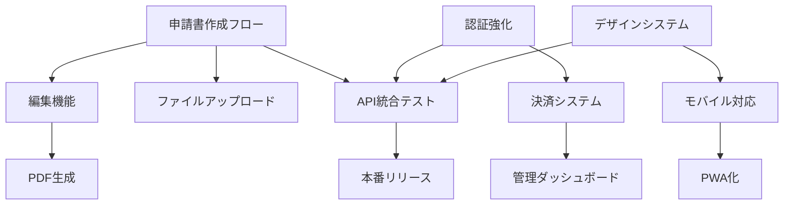

# AI補助金申請システム - 製品化完全計画 V2
## 一般販売可能レベルへの開発ロードマップ

## 現状分析と必要機能一覧

### 🔴 未実装の重要機能（優先度：高）

#### 1. **申請書作成フロー完全統合**
- 現状：バックエンドAPIは存在するが、フロントエンドが未接続
- 必要：ステップバイステップの申請書作成UI
- 技術：React Hook Form + Zod + React Query

#### 2. **申請書編集・プレビュー機能**
- 現状：生成後の編集機能が未実装
- 必要：リアルタイムプレビュー付きエディタ
- 技術：TipTap or Lexical エディタ

#### 3. **PDF生成・ダウンロード**
- 現状：バックエンドにPuppeteerがあるが未接続
- 必要：ワンクリックでPDF生成・ダウンロード
- 技術：Puppeteer + React-PDF

#### 4. **ファイルアップロード機能**
- 現状：ファイル管理テーブルはあるが機能未実装
- 必要：ドラッグ&ドロップ対応のアップローダー
- 技術：React Dropzone + MinIO/S3

#### 5. **ユーザー管理・認証強化**
- 現状：基本的な認証のみ
- 必要：2FA、パスワードリセット、メール認証
- 技術：Speakeasy (2FA) + SendGrid

#### 6. **支払い・サブスクリプション**
- 現状：未実装
- 必要：料金プラン、決済、請求書発行
- 技術：Stripe + Stripe Billing

#### 7. **管理者ダッシュボード**
- 現状：未実装
- 必要：ユーザー管理、利用統計、売上管理
- 技術：React Admin + Recharts

#### 8. **通知システム**
- 現状：メールサービスはあるが通知未実装
- 必要：申請期限、ステータス変更通知
- 技術：Bull Queue + WebSocket

### 🟡 品質向上のための機能（優先度：中）

#### 9. **多言語対応（i18n）**
- 日本語・英語・中国語対応
- react-i18next

#### 10. **モバイル対応**
- レスポンシブデザイン完全対応
- PWA化

#### 11. **オフライン対応**
- Service Worker実装
- IndexedDBでのローカル保存

#### 12. **分析・レポート機能**
- 申請成功率分析
- AI提案の効果測定

### 🟢 差別化機能（優先度：中〜低）

#### 13. **チーム協業機能**
- 複数人での申請書共同編集
- コメント・レビュー機能

#### 14. **テンプレートマーケットプレイス**
- 成功事例のテンプレート販売
- ユーザー間での共有

#### 15. **AIアシスタント強化**
- チャット形式での申請サポート
- 音声入力対応

---

## チーム別開発指示書

### 📋 チームA：コア機能実装チーム
**責任範囲：** 申請書作成・編集・出力の完全実装

#### Phase 1（2週間）
1. **申請書作成フロー実装**
   ```typescript
   // 実装ファイル
   - /frontend/src/features/application-wizard/
     - ApplicationWizard.tsx
     - steps/CompanyInfoStep.tsx
     - steps/ProjectPlanStep.tsx
     - steps/BudgetStep.tsx
     - steps/ReviewStep.tsx
   ```

2. **フォームバリデーション統合**
   ```typescript
   // Zodスキーマ定義
   - /frontend/src/schemas/applicationSchema.ts
   ```

3. **API接続実装**
   ```typescript
   // React Query hooks
   - /frontend/src/hooks/useApplicationMutations.ts
   - /frontend/src/hooks/useApplicationQueries.ts
   ```

#### Phase 2（2週間）
1. **リッチテキストエディタ実装**
   ```typescript
   - /frontend/src/components/editor/
     - RichTextEditor.tsx
     - EditorToolbar.tsx
     - AutoSaveProvider.tsx
   ```

2. **PDF生成・プレビュー**
   ```typescript
   - /frontend/src/features/pdf-preview/
     - PDFPreview.tsx
     - PDFDownloadButton.tsx
   - /backend/src/services/pdfGeneratorService.ts (改良)
   ```

3. **ファイルアップロード**
   ```typescript
   - /frontend/src/components/upload/
     - FileUploader.tsx
     - UploadProgress.tsx
   - /backend/src/routes/files.ts
   ```

### 📋 チームB：インフラ・認証・決済チーム
**責任範囲：** 認証強化、決済システム、管理機能

#### Phase 1（2週間）
1. **認証システム強化**
   ```typescript
   // 2FA実装
   - /backend/src/services/twoFactorService.ts
   - /frontend/src/features/auth/TwoFactorSetup.tsx
   
   // メール認証
   - /backend/src/routes/auth/verify-email.ts
   - /frontend/src/pages/auth/VerifyEmail.tsx
   ```

2. **Stripe決済統合**
   ```typescript
   - /backend/src/services/paymentService.ts
   - /backend/src/services/subscriptionService.ts
   - /backend/src/routes/payments.ts
   - /frontend/src/features/billing/
     - PricingPlans.tsx
     - PaymentForm.tsx
     - BillingHistory.tsx
   ```

#### Phase 2（2週間）
1. **管理者ダッシュボード**
   ```typescript
   - /frontend/src/admin/
     - AdminDashboard.tsx
     - UserManagement.tsx
     - SystemStats.tsx
     - RevenueAnalytics.tsx
   ```

2. **通知システム**
   ```typescript
   - /backend/src/services/notificationService.ts
   - /backend/src/workers/notificationWorker.ts
   - /frontend/src/features/notifications/
     - NotificationCenter.tsx
     - NotificationPreferences.tsx
   ```

### 📋 チームC：UX・品質向上チーム
**責任範囲：** UI/UX改善、モバイル対応、品質保証

#### Phase 1（2週間）
1. **デザインシステム完成**
   ```typescript
   - /frontend/src/design-system/
     - components/
     - themes/
     - animations/
   ```

2. **モバイル最適化**
   ```typescript
   - レスポンシブコンポーネント改修
   - タッチ操作対応
   - モバイル専用UI
   ```

3. **i18n実装**
   ```typescript
   - /frontend/src/i18n/
     - locales/ja/
     - locales/en/
     - locales/zh/
   ```

#### Phase 2（2週間）
1. **PWA化**
   ```typescript
   - /frontend/public/manifest.json
   - /frontend/src/serviceWorker.ts
   - オフライン対応
   ```

2. **パフォーマンス最適化**
   - コード分割
   - 画像最適化
   - キャッシュ戦略

3. **E2Eテスト実装**
   ```typescript
   - /frontend/cypress/
     - e2e/
     - fixtures/
     - support/
   ```

---

## 実装優先順位と依存関係



---

## 品質基準チェックリスト

### ✅ 機能要件
- [ ] 申請書の作成から提出まで完結
- [ ] すべてのAPIエンドポイントが機能
- [ ] エラーハンドリング完備
- [ ] データ整合性保証

### ✅ 非機能要件
- [ ] 応答時間 < 3秒
- [ ] 同時接続 1000ユーザー対応
- [ ] 99.9% アップタイム
- [ ] GDPR/個人情報保護法準拠

### ✅ ユーザビリティ
- [ ] 直感的なUI
- [ ] 分かりやすいエラーメッセージ
- [ ] ヘルプ・チュートリアル完備
- [ ] モバイルフレンドリー

### ✅ セキュリティ
- [ ] SQLインジェクション対策
- [ ] XSS対策
- [ ] CSRF対策
- [ ] 適切な認証・認可

---

## 開発スケジュール

### 第1スプリント（2週間）
- チームA：申請書作成フロー
- チームB：認証強化・決済準備
- チームC：デザインシステム・モバイル対応

### 第2スプリント（2週間）
- チームA：編集機能・PDF生成
- チームB：決済実装・管理画面
- チームC：i18n・PWA化

### 第3スプリント（1週間）
- 全チーム：統合テスト
- バグ修正
- パフォーマンスチューニング

### 第4スプリント（1週間）
- UAT（ユーザー受け入れテスト）
- ドキュメント整備
- リリース準備

---

## 見積もり

### 開発コスト
- 3名 × 6週間 = 18人週
- 時給5,000円 × 40時間 × 18 = 360万円

### インフラコスト（月額）
- AWS/GCP：約5万円
- Stripe手数料：売上の3.6%
- その他ツール：約2万円

### 初期投資合計
- 約400万円（開発＋初期セットアップ）

### 収益モデル
- フリープラン：月3件まで無料
- スタンダード：月額9,800円（無制限）
- プレミアム：月額29,800円（優先サポート付き）
- エンタープライズ：要相談

### 損益分岐点
- 月間有料ユーザー50名で黒字化