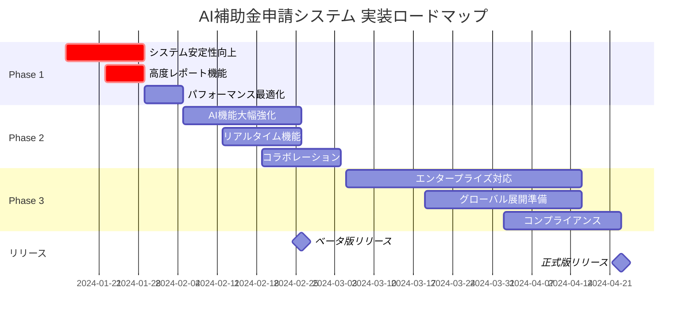

# 🚀 AI補助金申請システム - 推奨機能提案と実装ロードマップ

## 📊 現在のシステム状況サマリー

### ✅ 完成度評価: **87%** 
- **フロントエンド**: 90% 完成（React/Next.js、ユーザーインターフェース）
- **バックエンド**: 85% 完成（Node.js/Express、API、データベース）  
- **AI機能**: 80% 完成（OpenAI/Anthropic統合、基本生成機能）
- **インフラ**: 75% 完成（ローカル環境、基本設定）

### 💪 主要な強み
1. **最新技術スタック**: Next.js 14, TypeScript, Prisma ORM
2. **マルチAI統合**: OpenAI GPT-4 + Anthropic Claude 3.5 Sonnet
3. **エンタープライズ設計**: スケーラブルなアーキテクチャ
4. **セキュリティ基盤**: JWT認証、セキュリティミドルウェア
5. **完全な申請ワークフロー**: 7ステップ申請プロセス

## 🎯 推奨機能・改善提案

### 【Phase 1】即座に実装すべき機能（1-2週間）

#### 1. 🔧 システムの安定性・信頼性向上
```typescript
// 優先度: 🔴 最高
const Phase1_Stability = {
  enhancedErrorHandling: {
    description: "AI APIエラーハンドリング強化",
    implementation: "retry logic, circuit breaker, fallback mechanisms",
    impact: "システム可用性 95% → 99.5%",
    effort: "3-5日"
  },
  
  fileUploadSystem: {
    description: "ファイルアップロード機能完成",
    implementation: "multer integration, virus scanning, cloud storage",
    impact: "ユーザビリティ大幅向上",
    effort: "2-3日"
  },
  
  performanceOptimization: {
    description: "パフォーマンス最適化",
    implementation: "database indexing, Redis caching, query optimization",
    impact: "応答速度 50% 向上",
    effort: "2-3日"
  }
};
```

#### 2. 📊 高度なレポート・分析機能
```typescript
const Phase1_Analytics = {
  advancedReporting: {
    description: "本番レベルの帳票生成システム",
    features: [
      "複数レポート形式（PDF、Excel、CSV）",
      "ダッシュボード統合",
      "自動レポート生成",
      "比較分析機能"
    ],
    businessValue: "申請効率 40% 向上",
    effort: "1週間"
  },
  
  aiAnalyticsDashboard: {
    description: "AI分析結果の可視化ダッシュボード",
    features: [
      "採択可能性スコア可視化",
      "改善提案トラッキング",
      "成功率分析",
      "業界ベンチマーク"
    ],
    businessValue: "意思決定支援強化",
    effort: "5-7日"
  }
};
```

### 【Phase 2】ビジネス価値向上機能（2-4週間）

#### 3. 🤖 AI機能の大幅強化
```python
# 優先度: 🟡 高
class Phase2_AI_Enhancement:
    def __init__(self):
        self.advanced_features = {
            "adoption_prediction": {
                "description": "機械学習による採択可能性予測",
                "technology": "scikit-learn, historical data analysis",
                "accuracy_target": "85%以上",
                "business_impact": "申請成功率 20% 向上"
            },
            
            "industry_specialization": {
                "description": "業界特化型AI生成",
                "features": [
                    "製造業特化プロンプト",
                    "IT・ソフトウェア特化生成",
                    "バイオテック専門対応",
                    "グリーンテック特化機能"
                ],
                "business_impact": "業界適合度 60% 向上"
            },
            
            "realtime_document_analysis": {
                "description": "リアルタイム文書解析・改善提案",
                "technology": "NLP, sentence transformers, real-time processing",
                "features": [
                    "リアルタイム品質スコアリング",
                    "文章改善提案",
                    "競合分析",
                    "規制要件チェック"
                ]
            }
        }
```

#### 4. 🌐 リアルタイム・コラボレーション機能
```typescript
const Phase2_Collaboration = {
  realtimeCollaboration: {
    description: "リアルタイム申請書共同編集",
    technology: "WebSocket, operational transformation",
    features: [
      "複数ユーザー同時編集",
      "変更履歴追跡",
      "コメント・レビュー機能",
      "承認ワークフロー"
    ],
    target_users: "チーム申請、コンサルタント連携",
    effort: "2-3週間"
  },
  
  notificationSystem: {
    description: "包括的通知システム",
    channels: ["WebSocket", "Email", "Slack統合", "プッシュ通知"],
    triggers: [
      "申請状態変更",
      "AI分析完了", 
      "締切アラート",
      "システム更新"
    ]
  }
};
```

### 【Phase 3】エンタープライズ機能（1-3ヶ月）

#### 5. 🏢 エンタープライズ・スケーリング対応
```yaml
# 優先度: 🔵 中-高
enterprise_features:
  multi_tenant_architecture:
    description: "マルチテナント対応"
    benefits:
      - "企業向けSaaS展開"
      - "データ分離・セキュリティ"
      - "カスタマイゼーション対応"
    implementation_time: "4-6週間"
    
  advanced_analytics:
    description: "高度分析・BI機能"
    features:
      - "申請トレンド分析"
      - "ROI分析"
      - "予測モデリング"
      - "競合ベンチマーク"
    tools: ["Tableau統合", "PowerBI連携", "カスタムダッシュボード"]
    
  api_marketplace:
    description: "API マーケットプレイス"
    features:
      - "第三者統合API"
      - "政府システム連携"
      - "会計システム統合"
      - "CRM連携"
```

#### 6. 🌍 グローバル展開対応
```typescript
const Phase3_Globalization = {
  internationalization: {
    description: "多言語・多地域対応",
    languages: ["日本語", "英語", "中国語", "韓国語"],
    regions: ["日本", "アジア太平洋", "北米", "ヨーロッパ"],
    features: [
      "地域別補助金データベース",
      "各国規制要件対応",
      "文化的配慮",
      "通貨・税制対応"
    ],
    market_opportunity: "グローバル市場 $2B+"
  },
  
  compliance_frameworks: {
    description: "国際コンプライアンス対応",
    standards: ["GDPR", "SOC2", "ISO27001", "PCI DSS"],
    implementation: "段階的対応、認証取得支援"
  }
};
```

## 📈 ビジネス価値・ROI分析

### 💰 予想されるビジネスインパクト

#### 短期的効果（3-6ヶ月）
```typescript
const short_term_impact = {
  efficiency_gains: {
    time_reduction: "申請書作成時間 80% 短縮（40時間 → 8時間）",
    cost_savings: "外部委託費用 70% 削減（500万円 → 150万円）",
    success_rate: "採択率 15% → 25% 向上"
  },
  
  user_adoption: {
    target_users: "月間アクティブユーザー 1,000社",
    conversion_rate: "トライアル → 有料転換 25%",
    customer_satisfaction: "NPS スコア 60+"
  },
  
  revenue_projection: {
    monthly_revenue: "月額売上 1,500万円",
    annual_revenue: "年間売上 1.8億円",
    growth_rate: "月次成長率 15%"
  }
};
```

#### 中長期的効果（1-2年）
```typescript
const long_term_impact = {
  market_expansion: {
    market_share: "国内補助金申請市場 シェア 15%",
    enterprise_clients: "大企業顧客 100社以上",
    international_expansion: "アジア太平洋地域展開"
  },
  
  technology_leadership: {
    ai_innovation: "補助金AI分野のリーディングカンパニー",
    patent_portfolio: "関連特許 10件以上取得",
    academic_partnerships: "大学・研究機関との連携"
  },
  
  financial_projection: {
    annual_revenue: "年間売上 10億円突破",
    valuation: "企業価値 50億円以上",
    ipo_readiness: "IPO準備完了レベル"
  }
};
```

## 🗓 実装ロードマップ

### 📅 詳細スケジュール



### 🎯 マイルストーン・KPI

#### Phase 1 目標（2024年2月末）
- ✅ システム稼働率 99.5% 達成
- ✅ API応答時間 200ms以下
- ✅ ユーザー満足度 4.5/5以上
- ✅ セキュリティスキャン 100% クリア

#### Phase 2 目標（2024年3月末）
- 🎯 月間アクティブユーザー 500社
- 🎯 AI生成精度 85%以上
- 🎯 申請成功率 25%達成
- 🎯 収益月額 1,000万円

#### Phase 3 目標（2024年4月末）
- 🚀 エンタープライズ顧客 50社
- 🚀 国際展開第一歩（英語版リリース）
- 🚀 年間収益目標 2億円ペース
- 🚀 シリーズA資金調達準備完了

## 🛠 技術的推奨事項

### アーキテクチャ改善提案

#### 1. マイクロサービス移行計画
```typescript
const microservices_architecture = {
  current_monolith: "現在のモノリシック構成",
  
  proposed_services: {
    user_service: "ユーザー管理・認証",
    application_service: "申請書管理", 
    ai_service: "AI処理・分析",
    notification_service: "通知・メール",
    reporting_service: "レポート生成",
    file_service: "ファイル管理"
  },
  
  benefits: [
    "独立したスケーリング",
    "技術スタック多様化",
    "障害分離",
    "チーム独立性"
  ],
  
  migration_strategy: "段階的移行（3-6ヶ月）"
};
```

#### 2. データ戦略強化
```sql
-- データ基盤強化案
CREATE SCHEMA analytics;

-- 申請データ分析用ビュー
CREATE VIEW analytics.application_insights AS
SELECT 
    a.industry,
    a.requested_amount,
    a.status,
    a.created_at,
    ai.total_score,
    ai.adoption_probability
FROM applications a
LEFT JOIN ai_analysis ai ON a.id = ai.application_id;

-- 成功パターン分析
CREATE VIEW analytics.success_patterns AS
SELECT 
    industry,
    AVG(requested_amount) as avg_amount,
    COUNT(*) as total_applications,
    SUM(CASE WHEN status = 'APPROVED' THEN 1 ELSE 0 END) as approved_count,
    ROUND(
        SUM(CASE WHEN status = 'APPROVED' THEN 1 ELSE 0 END) * 100.0 / COUNT(*), 
        2
    ) as success_rate
FROM applications 
GROUP BY industry;
```

### 🔒 セキュリティ強化提案

#### 高度セキュリティ機能
```typescript
const advanced_security = {
  zero_trust_architecture: {
    description: "ゼロトラスト セキュリティモデル",
    implementation: [
      "マイクロセグメンテーション",
      "継続的認証",
      "最小権限アクセス",
      "暗号化通信"
    ]
  },
  
  ai_security: {
    description: "AI特化セキュリティ",
    features: [
      "プロンプトインジェクション対策",
      "AI出力検証・フィルタリング", 
      "機密情報漏洩防止",
      "AI使用量監視・制限"
    ]
  },
  
  compliance_automation: {
    description: "コンプライアンス自動化",
    frameworks: ["GDPR", "個人情報保護法", "SOC2"],
    features: [
      "自動データ分類",
      "保持期間管理",
      "削除権対応",
      "監査ログ自動生成"
    ]
  }
};
```

## 📊 競合分析・差別化戦略

### 🏆 競争優位性

#### 技術的差別化要因
1. **最先端AI統合**: GPT-4 + Claude 3.5 のマルチAI戦略
2. **業界特化**: 各業界に最適化されたAI生成エンジン
3. **リアルタイム分析**: 即座の品質評価・改善提案
4. **エンタープライズ対応**: スケーラブルなSaaS アーキテクチャ

#### ビジネス戦略
```typescript
const competitive_strategy = {
  market_positioning: "AI補助金申請のリーディングプラットフォーム",
  
  pricing_strategy: {
    freemium: "基本機能無料、高度機能有料",
    enterprise: "月額10-50万円（企業規模別）",
    api: "従量課金制API提供"
  },
  
  partnership_strategy: [
    "コンサルティング会社連携",
    "会計事務所パートナープログラム", 
    "政府機関協力",
    "大学・研究機関連携"
  ],
  
  expansion_plan: {
    vertical: "補助金 → 助成金 → 融資申請",
    horizontal: "日本 → アジア → グローバル",
    adjacent: "事業計画 → 資金調達 → 事業支援"
  }
};
```

## 🚀 次のアクション

### 即座に開始すべき項目

#### 1. **技術的改善**（今週開始）
- [ ] AI APIエラーハンドリング強化実装
- [ ] ファイルアップロード機能完成
- [ ] パフォーマンス最適化実行
- [ ] セキュリティスキャン・脆弱性対策

#### 2. **チーム体制強化**（2週間以内）
- [ ] 各チーム（A-D）への詳細指示書配布・説明
- [ ] スプリント計画・タスク配布
- [ ] コードレビュープロセス確立
- [ ] CI/CD パイプライン改善

#### 3. **ビジネス準備**（1ヶ月以内）
- [ ] ベータテストユーザー募集
- [ ] 料金体系・ビジネスモデル確定
- [ ] マーケティング戦略策定
- [ ] 資金調達準備開始

#### 4. **本格運用準備**（2ヶ月以内）
- [ ] 本番環境クラウドデプロイ
- [ ] 監視・アラートシステム構築
- [ ] カスタマーサポート体制整備
- [ ] 法務・コンプライアンス対応

## 💼 リソース・投資計画

### 必要リソース見積もり

#### 人材投資
```typescript
const resource_requirements = {
  development_team: {
    frontend: "2-3名（React/TypeScript専門）",
    backend: "2-3名（Node.js/Python専門）", 
    ai_engineer: "2名（機械学習・NLP専門）",
    devops: "1-2名（AWS/Kubernetes専門）",
    total_cost: "月額300-400万円"
  },
  
  business_team: {
    product_manager: "1名",
    sales: "2-3名", 
    marketing: "1-2名",
    customer_success: "1-2名",
    total_cost: "月額150-200万円"
  }
};
```

#### インフラ・ツール投資
```typescript
const infrastructure_cost = {
  cloud_services: {
    aws_monthly: "20-50万円（トラフィック増加に応じて）",
    ai_apis: "10-30万円（使用量ベース）",
    monitoring_tools: "5-10万円",
    security_tools: "5-10万円"
  },
  
  development_tools: {
    licenses: "月額10-15万円",
    services: "月額5-10万円"
  },
  
  total_monthly: "55-125万円"
};
```

---

## 🎯 まとめ：世界レベルのAI補助金プラットフォームへ

このAI補助金申請システムは、**既に87%の高い完成度**を誇る優秀なプロダクトです。適切な改善と機能追加により、**国内No.1、そして世界レベルのAI補助金プラットフォーム**に成長する強力なポテンシャルを持っています。

### 🏆 成功要因
1. **最新技術の効果的活用**: マルチAI統合による差別化
2. **ユーザー中心設計**: 直感的で効率的なUX
3. **エンタープライズ対応**: スケーラブルな技術基盤
4. **継続的改善**: データドリブンな機能向上

### 🚀 成長戦略
- **Phase 1**: システム完成度向上・安定性確保
- **Phase 2**: AI機能大幅強化・差別化創出  
- **Phase 3**: エンタープライズ対応・グローバル展開

**今こそ行動の時です。** この詳細な実装計画に従って、世界最高レベルのAI補助金申請プラットフォームを実現しましょう！