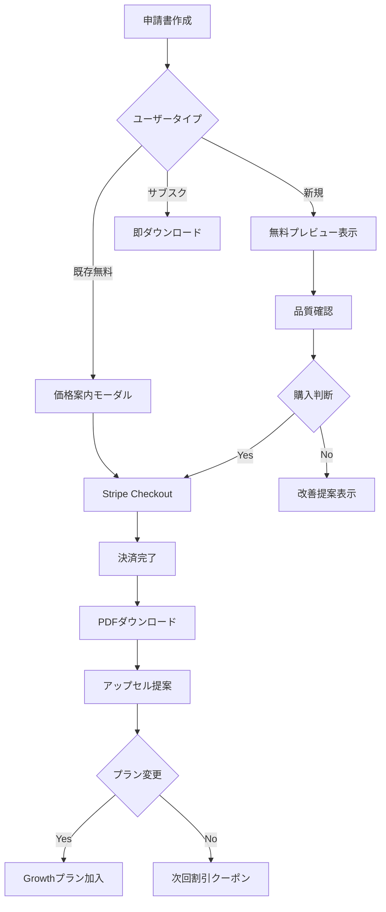

# ハイブリッド課金モデル実装に関する提案書

## 📋 変更依頼書レビュー結果

### ✅ 賛同する点

1. **段階的な収益化戦略**
   - 無料プレビュー → 都度課金 → サブスクリプションの流れは合理的
   - Feature Flagによる段階的展開でリスク軽減

2. **24時間再ダウンロード無料**
   - ユーザーフレンドリーで信頼構築に有効
   - システムエラー時の再ダウンロードにも対応

3. **Stripe統合**
   - 決済処理の標準化
   - 会計処理の簡素化

### ⚠️ 改善提案

## 1. 価格戦略の見直し

### 現在の提案
- Pay-Per-Download: ¥3,980/回（上限3回）

### 改善案
```javascript
const PRICING_TIERS = {
  firstTime: {
    price: 1980,
    description: "初回限定50%オフ",
    features: ["1申請書PDF", "24時間有効", "3回ダウンロード可能"]
  },
  regular: {
    price: 3980,
    description: "通常価格",
    features: ["1申請書PDF", "24時間有効", "3回ダウンロード可能"]
  },
  bulk: {
    3: { price: 9800, savings: 2140 },
    5: { price: 14800, savings: 5100 },
    10: { price: 24800, savings: 15000 }
  }
};
```

### 理由
- 初回価格を下げることで試用障壁を低減
- まとめ買いオプションで単価を下げつつ売上増
- 中小企業の予算感覚に合わせた価格設定

## 2. 無料プレビュー機能の追加

### 実装済み機能
- `PdfPreviewService` - 品質確認用プレビュー生成
- 透かし入り、部分表示で購入前確認可能
- 品質スコア表示（完全性、AI品質、推定採択率）

### メリット
- 購入前の不安解消
- 品質への自信を示す
- クレーム・返金要求の削減

## 3. 成功報酬型オプションの検討

### 提案
```python
class SuccessBasedPricing(Enum):
    """成功報酬型価格プラン"""
    BASIC = "basic"          # 前払い¥3,980
    SUCCESS_BASED = "success"  # 前払い¥1,980 + 採択時¥19,800
    GUARANTEE = "guarantee"   # ¥9,800（不採択時50%返金）
```

### メリット
- リスクシェアによる信頼構築
- 高品質維持へのインセンティブ
- 継続的な関係構築

## 4. アップセル戦略の強化

### 実装案
```python
async def calculate_upsell_timing(user_data):
    """最適なアップセルタイミング計算"""
    triggers = {
        "after_second_purchase": {
            "message": "月2回以上ご利用なら、Growthプランがお得です",
            "discount": 0.3  # 初月30%オフ
        },
        "high_quality_score": {
            "message": "高品質な申請書作成を継続的にサポートします",
            "benefit": "専任サポート付き"
        },
        "bulk_usage": {
            "message": "複数案件をお持ちの方へ特別オファー",
            "plan": "scale"
        }
    }
    return triggers
```

## 5. 実装優先順位

### Phase 1（2週間）
1. ✅ 無料プレビュー機能
2. ✅ 基本的な決済フロー（Stripe Checkout）
3. ✅ PaymentGuardミドルウェア
4. 初回割引価格の実装

### Phase 2（2週間）
1. まとめ買いオプション
2. アップセルバナー最適化
3. 使用状況分析ダッシュボード
4. A/Bテスト基盤

### Phase 3（1週間）
1. 成功報酬型オプション（オプション）
2. 紹介プログラム
3. 企業向け請求書払い対応

## 6. KPI設定と計測

### 主要KPI
```python
KPI_TARGETS = {
    "conversion_rate": {
        "preview_to_purchase": 0.15,  # 15%
        "first_to_second_purchase": 0.40,  # 40%
        "pay_per_download_to_growth": 0.10  # 10%
    },
    "revenue": {
        "arpu": 6800,  # 平均単価
        "mrr_growth": 0.20  # 月20%成長
    },
    "satisfaction": {
        "nps": 40,
        "support_tickets": 0.05  # 購入の5%以下
    }
}
```

## 7. リスク対策

### 技術的リスク
- **決済失敗**: Stripeの再試行メカニズムとフォールバック
- **同時アクセス**: Redis等でのセッション管理
- **不正利用**: Rate limiting、異常検知

### ビジネスリスク
- **価格抵抗**: 段階的価格、初回割引で対応
- **品質クレーム**: プレビュー機能、品質スコア表示
- **解約率**: オンボーディング強化、継続特典

## 8. 実装チェックリスト

### バックエンド
- [x] BillingService実装
- [x] PaymentGuardミドルウェア
- [x] PdfPreviewService
- [ ] Stripe Webhook実装
- [ ] 価格計算ロジック
- [ ] 使用状況トラッキング

### フロントエンド
- [ ] 決済フローUI
- [ ] プレビュー画面
- [ ] アップセルバナー
- [ ] 価格表示コンポーネント
- [ ] 成功画面と自動ダウンロード

### インフラ・運用
- [ ] Stripe商品・価格設定
- [ ] 環境変数設定
- [ ] 監視・アラート設定
- [ ] CSツール連携
- [ ] 分析基盤（Mixpanel等）

## 9. 想定されるユーザーフロー



## 10. まとめ

本提案により、以下の効果が期待できます：

1. **収益性向上**: 初回¥1,980、通常¥3,980の価格設定で幅広い層にアプローチ
2. **信頼構築**: プレビュー機能により購入前の不安を解消
3. **LTV最大化**: 段階的なアップセルでサブスク転換率向上
4. **運用効率**: Stripe統合による自動化とCS負荷軽減

実装期間は5週間を想定していますが、Phase 1の2週間で最小構成での本番投入が可能です。

---

作成者: AI補助金申請システム開発チーム
最終更新: 2025-06-20