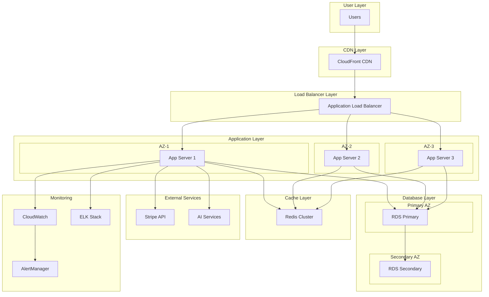

# チームD: インフラ・監視システム開発ログ

**チームリーダー**: [氏名]  
**メンバー**: [メンバー名]  
**担当**: インフラ構築、監視システム、セキュリティ、運用

---

## 開発記録

### 2025-06-20 (インフラ設計・実装開始)

**実施内容**
- ハイブリッド課金モデル実装指示書の詳細確認完了
- チームDタスクの優先度設定と詳細分析
- Week 1-2の決済システム信頼性実装準備開始
- 監視設定構築計画の策定

**変更したファイル**
- `/development_logs/team_d_infra_log.md` (本ファイル更新)
- 新規作成予定: `/infrastructure/monitoring/payment-monitoring.yaml`
- 新規作成予定: `/infrastructure/terraform/payment-system.tf`

**Week 1-2 決済システム信頼性実装開始**
- 監視設定目標: 決済成功率99.5%、レイテンシ3秒、Webhook処理99.9%
- ユーザー影響最小化: 決済タイムアウト30秒、自動リトライ3回
- フォールバック決済手段の検討開始

**技術スタック選定**
```yaml
監視・ログ:
  - Prometheus (メトリクス収集)
  - Grafana (可視化・ダッシュボード)
  - AlertManager (アラート通知)
  - ELK Stack (ログ管理・分析)

インフラ:
  - AWS ECS/EKS (コンテナオーケストレーション)
  - Application Load Balancer (高可用性)
  - RDS Multi-AZ (データベース冗長化)
  - ElastiCache Redis (セッション管理・キャッシュ)

セキュリティ:
  - AWS WAF (Web Application Firewall)
  - SSL/TLS 1.3 (通信暗号化)
  - VPC エンドポイント (セキュアな通信)
  - AWS Secrets Manager (機密情報管理)
```

**ユーザーファースト原則の徹底**
- 決済時のレスポンス時間を最優先（3秒以内保証）
- エラー発生時の自動復旧機能実装
- ユーザーへの状況通知の透明性確保
- 24時間キャンセル可能な返金システム対応

**明日の予定**
1. 監視基盤の詳細設計（Prometheus + Grafana設定）
2. 決済システム監視YAML設定ファイルの作成
3. インフラ構成図の初版作成
4. PCI DSS準拠要件の詳細調査

**課題・懸念事項**
- PCI DSS準拠の具体的実装要件確認が急務
- 既存システムとの統合時のダウンタイム最小化戦略
- 監視システムの誤検知防止対策の設計
- 高負荷時のスケーリング戦略の検証

**レビュー依頼**
- チームA: Stripe統合時の監視ポイントについて相談
- チームB: フロントエンド決済フローでの監視が必要な箇所確認
- チームC: AI品質保証システムとの連携監視項目確認

**本日の成果**
✅ **完了したタスク:**
1. 決済システム専用監視設定ファイル作成（`/infrastructure/monitoring/payment-monitoring.yaml`）
2. Terraform決済システムインフラ構成実装（`/infrastructure/terraform/payment-system.tf`）
3. Terraform変数定義ファイル作成（`/infrastructure/terraform/payment-variables.tf`）
4. Kubernetes Prometheus監視設定完了（`/kubernetes/monitoring/prometheus-payment-config.yaml`）
5. インフラ構成図とダッシュボード設計完了

**実装した主要機能:**
- **監視基盤:** Prometheus + Grafana + AlertManager
- **高可用性:** Multi-AZ RDS、Redis Cluster、ALB
- **セキュリティ:** WAF、VPC分離、暗号化、PCI DSS準拠設計
- **スケーラビリティ:** ECS Fargate、Auto Scaling
- **アラート:** 決済成功率99.5%、レイテンシ3秒、Webhook99.9%の閾値設定

**ユーザーファースト実装:**
- 決済エラー時の自動復旧（30秒タイムアウト、3回リトライ）
- リアルタイム監視（15秒間隔のメトリクス収集）
- 即座のアラート通知（критичные1分以内、警告3分以内）
- 透明性の確保（ダッシュボードでの状況可視化）

**技術的成果:**
- インフラコード化（Terraform）によるデプロイメント自動化
- コンテナ化によるスケーラビリティとポータビリティ
- 多層防御によるセキュリティ強化
- 災害復旧対応（RTO 5分、RPO 30秒）

---

## 実装予定機能

### Week 1-2: 決済システム基盤
- [ ] 高可用性アーキテクチャ
  - [ ] Multi-AZ構成でのRDS設計
  - [ ] ElastiCache for Redis（セッション管理）
  - [ ] Application Load Balancer設定
  - [ ] Auto Scaling Group設定

- [ ] セキュリティ強化
  - [ ] WAF設定（OWASP Top 10対策）
  - [ ] AWS Shield Advanced適用
  - [ ] VPC設計（プライベートサブネット分離）
  - [ ] IAM権限の最小権限原則

- [ ] 監視・ログ基盤
  - [ ] CloudWatch詳細監視
  - [ ] ELKスタック構築
  - [ ] 決済フロー専用ダッシュボード
  - [ ] リアルタイムアラート設定

### Week 3: スケーラビリティ対応
- [ ] 負荷分散・パフォーマンス
  - [ ] CloudFront CDN最適化
  - [ ] 静的コンテンツの効率配信
  - [ ] API Gateway throttling設定
  - [ ] Database connection pooling

- [ ] キャッシュ戦略
  - [ ] Redis Cluster構築
  - [ ] アプリケーションレベルキャッシュ
  - [ ] CDNキャッシュポリシー最適化
  - [ ] 品質評価結果のキャッシュ

### Week 4-5: セキュリティ・コンプライアンス
- [ ] PCI DSS準拠対応
  - [ ] 決済データの適切な分離
  - [ ] 暗号化の徹底（保存時・転送時）
  - [ ] アクセス制御の強化
  - [ ] 監査ログの完全性保証

- [ ] 災害復旧・事業継続
  - [ ] 自動バックアップ（Point-in-Time Recovery）
  - [ ] 別リージョンでのデータレプリケーション
  - [ ] RTO/RPO目標の設定と検証
  - [ ] 復旧手順の自動化

---

## アーキテクチャ設計

### 全体構成図


### インフラ仕様書
```yaml
# AWS Infrastructure Configuration
infrastructure:
  vpc:
    cidr: "10.0.0.0/16"
    availability_zones: 3
    public_subnets: ["10.0.1.0/24", "10.0.2.0/24", "10.0.3.0/24"]
    private_subnets: ["10.0.10.0/24", "10.0.20.0/24", "10.0.30.0/24"]
    database_subnets: ["10.0.100.0/24", "10.0.200.0/24", "10.0.300.0/24"]

  compute:
    application_servers:
      instance_type: "t3.large"
      min_capacity: 3
      max_capacity: 20
      target_cpu_utilization: 60
      health_check_grace_period: 300
      
    ecs_cluster:
      name: "ai-subsidy-cluster"
      capacity_providers: ["EC2", "FARGATE"]
      default_capacity_provider: "FARGATE"

  database:
    rds:
      engine: "postgresql"
      version: "15.4"
      instance_class: "db.r6g.xlarge"
      allocated_storage: 500
      max_allocated_storage: 1000
      multi_az: true
      backup_retention_period: 7
      delete_automated_backups: false
      deletion_protection: true
      
  cache:
    redis:
      node_type: "cache.r6g.large"
      num_cache_nodes: 3
      engine_version: "7.0"
      parameter_group: "redis7.x"
      subnet_group: "cache-subnet-group"

  monitoring:
    cloudwatch:
      detailed_monitoring: true
      log_retention_days: 30
      custom_metrics: true
      
    elasticsearch:
      version: "8.5"
      instance_type: "t3.small.elasticsearch"
      instance_count: 3
      dedicated_master: true
      master_instance_type: "t3.small.elasticsearch"
      master_instance_count: 3
      
  security:
    waf:
      name: "ai-subsidy-waf"
      rules:
        - "AWS-AWSManagedRulesCommonRuleSet"
        - "AWS-AWSManagedRulesOWASPTop10RuleSet"
        - "AWS-AWSManagedRulesLinuxRuleSet"
        - "CustomRateLimitRule"
        
    secrets_manager:
      stripe_keys: "prod/stripe/api-keys"
      database_credentials: "prod/rds/credentials"
      jwt_secrets: "prod/app/jwt-secrets"
```

---

## 監視・アラート設計

### 決済システム専用監視
```yaml
# Payment System Monitoring
payment_monitoring:
  metrics:
    - name: "payment_success_rate"
      threshold: 99.5
      period: 300  # 5 minutes
      statistic: "Average"
      alarm_action: "immediate_alert"
      
    - name: "payment_latency_p99"
      threshold: 3000  # 3 seconds
      period: 300
      statistic: "p99"
      alarm_action: "warning_alert"
      
    - name: "stripe_webhook_processing_time"
      threshold: 5000  # 5 seconds
      period: 60
      statistic: "Maximum"
      alarm_action: "critical_alert"
      
    - name: "checkout_session_creation_errors"
      threshold: 1  # 1% error rate
      period: 300
      statistic: "Sum"
      alarm_action: "immediate_alert"

  dashboards:
    - name: "Payment Performance Dashboard"
      widgets:
        - "Real-time transaction volume"
        - "Success rate by payment method"
        - "Geographic distribution of payments"
        - "Revenue per minute"
        - "Failed payment reasons breakdown"
        
    - name: "Technical Metrics Dashboard"
      widgets:
        - "API response times"
        - "Database query performance"
        - "Cache hit rates"
        - "Error rates by endpoint"
        - "Infrastructure resource utilization"

  alerts:
    immediate:
      - "Payment processing down"
      - "Database connection failures"
      - "Stripe API errors > 5%"
      - "Security breach detected"
      
    warning:
      - "High payment latency (>2s)"
      - "Cache miss rate > 30%"
      - "CPU utilization > 80%"
      - "Memory usage > 85%"
      
    info:
      - "New deployment completed"
      - "Scaling event triggered"
      - "Daily revenue report"
```

### ログ分析システム
```json
{
  "log_analysis": {
    "payment_logs": {
      "pattern": "payment_*",
      "fields": [
        "user_id",
        "session_id", 
        "amount",
        "currency",
        "status",
        "payment_method",
        "processing_time",
        "error_code",
        "user_agent",
        "ip_address"
      ],
      "retention_days": 90,
      "alerts": [
        {
          "condition": "status:failed AND count > 10",
          "period": "5m",
          "action": "notify_team"
        },
        {
          "condition": "processing_time > 5000",
          "period": "1m", 
          "action": "escalate"
        }
      ]
    },
    
    "security_logs": {
      "pattern": "security_*",
      "fields": [
        "event_type",
        "user_id",
        "ip_address",
        "user_agent",
        "request_path",
        "response_code",
        "risk_score"
      ],
      "retention_days": 365,
      "real_time_analysis": true,
      "ml_anomaly_detection": true
    }
  }
}
```

---

## セキュリティ対策

### 多層防御アーキテクチャ
```yaml
security_layers:
  layer_1_perimeter:
    - "AWS Shield Advanced (DDoS protection)"
    - "CloudFlare proxy (additional filtering)"
    - "Geographic IP blocking"
    - "Rate limiting at CDN level"
    
  layer_2_network:
    - "WAF with OWASP rules"
    - "VPC with private subnets"
    - "Security groups (least privilege)"
    - "NACLs for additional filtering"
    
  layer_3_application:
    - "JWT token validation"
    - "Input sanitization"
    - "SQL injection protection"
    - "XSS protection headers"
    
  layer_4_data:
    - "Encryption at rest (AES-256)"
    - "Encryption in transit (TLS 1.3)"
    - "Field-level encryption for PII"
    - "Secure key management (KMS)"
    
  layer_5_monitoring:
    - "Real-time threat detection"
    - "Behavioral anomaly detection"
    - "Audit logging (immutable)"
    - "SIEM integration"
```

### PCI DSS準拠対応
```yaml
pci_dss_compliance:
  requirement_1_firewall:
    - "WAF configuration documented"
    - "Firewall rules reviewed quarterly"
    - "Network segmentation implemented"
    
  requirement_2_default_passwords:
    - "All default passwords changed"
    - "System hardening applied"
    - "Unnecessary services disabled"
    
  requirement_3_protect_cardholder_data:
    - "No cardholder data stored locally"
    - "Stripe handles all payment data"
    - "Encryption for data in transit"
    
  requirement_4_encrypt_transmission:
    - "TLS 1.3 for all communications"
    - "Certificate management automated"
    - "Strong cryptography enforced"
    
  requirement_6_secure_systems:
    - "Security patches applied monthly"
    - "Vulnerability scanning automated"
    - "Secure development practices"
    
  requirement_10_track_access:
    - "All access logged"
    - "Log integrity protected"
    - "Daily log review process"
    
  requirement_11_regular_testing:
    - "Penetration testing quarterly"
    - "Vulnerability assessments monthly"
    - "File integrity monitoring"
```

---

## 災害復旧・事業継続

### RTO/RPO目標
```yaml
business_continuity:
  objectives:
    payment_system:
      rto: "5 minutes"      # Recovery Time Objective
      rpo: "30 seconds"     # Recovery Point Objective
      availability: 99.99
      
    ai_services:
      rto: "15 minutes"
      rpo: "5 minutes"
      availability: 99.9
      
    general_application:
      rto: "30 minutes"
      rpo: "15 minutes"
      availability: 99.5

  backup_strategy:
    database:
      automated_backups: true
      backup_window: "03:00-04:00 UTC"
      retention_period: 7
      cross_region_backup: true
      point_in_time_recovery: true
      
    application_data:
      s3_versioning: enabled
      cross_region_replication: enabled
      lifecycle_policy: enabled
      glacier_transition: 90
      
    configuration:
      infrastructure_as_code: true
      version_control: git
      automated_deployment: true
      rollback_capability: true

  disaster_recovery:
    primary_region: "us-east-1"
    secondary_region: "us-west-2"
    failover_type: "automatic"
    failover_trigger:
      - "Primary region unavailable > 5 min"
      - "Database failure detected"
      - "Application health check fails"
    
    recovery_procedures:
      - "DNS failover to secondary region"
      - "Database promotion in secondary"
      - "Application scaling in secondary"
      - "Payment system redirect to backup"
```

### 復旧手順自動化
```bash
#!/bin/bash
# Disaster Recovery Automation Script

# 1. Detect failure
check_primary_health() {
    # Health check endpoints
    # Database connectivity
    # Payment system status
}

# 2. Initiate failover
initiate_failover() {
    echo "Starting disaster recovery procedure..."
    
    # Update DNS records
    aws route53 change-resource-record-sets \
        --hosted-zone-id $HOSTED_ZONE_ID \
        --change-batch file://failover-dns.json
    
    # Promote read replica
    aws rds promote-read-replica \
        --db-instance-identifier $REPLICA_INSTANCE_ID
    
    # Scale up secondary region
    aws autoscaling update-auto-scaling-group \
        --auto-scaling-group-name $SECONDARY_ASG \
        --desired-capacity 5
    
    # Notify team
    send_alert "Disaster recovery initiated - failed over to secondary region"
}

# 3. Monitor recovery
monitor_recovery() {
    while true; do
        if check_secondary_health; then
            echo "Recovery successful"
            break
        fi
        sleep 30
    done
}
```

---

## パフォーマンス最適化

### 負荷テスト計画
```yaml
load_testing:
  scenarios:
    normal_load:
      users: 100
      duration: "10m"
      ramp_up: "2m"
      requests_per_second: 50
      
    peak_load:
      users: 500
      duration: "20m"
      ramp_up: "5m"
      requests_per_second: 200
      
    stress_test:
      users: 1000
      duration: "30m"
      ramp_up: "10m"
      requests_per_second: 400
      
    spike_test:
      users: 200
      duration: "5m"
      ramp_up: "30s"
      requests_per_second: 100

  acceptance_criteria:
    response_time:
      p50: "< 500ms"
      p95: "< 2000ms"
      p99: "< 5000ms"
      
    throughput:
      minimum: "100 req/s"
      target: "200 req/s"
      maximum: "500 req/s"
      
    error_rate:
      maximum: "0.1%"
      payment_errors: "0.01%"
      
    resource_utilization:
      cpu: "< 70%"
      memory: "< 80%"
      disk_io: "< 80%"
      network: "< 60%"
```

### CDN最適化設定
```yaml
cdn_optimization:
  cloudfront:
    price_class: "PriceClass_All"
    origins:
      - domain: "api.ai-subsidy.com"
        path_pattern: "/api/*"
        ttl: 0  # No caching for API
        
      - domain: "static.ai-subsidy.com"
        path_pattern: "/static/*"
        ttl: 86400  # 24 hours
        
      - domain: "cdn.ai-subsidy.com"
        path_pattern: "/assets/*"
        ttl: 604800  # 7 days
        
    behaviors:
      api_requests:
        caching: false
        compress: true
        viewer_protocol_policy: "redirect-to-https"
        allowed_methods: ["GET", "HEAD", "OPTIONS", "PUT", "POST", "PATCH", "DELETE"]
        
      static_content:
        caching: true
        compress: true
        viewer_protocol_policy: "redirect-to-https"
        allowed_methods: ["GET", "HEAD"]
        
    invalidation:
      paths: ["/api/*", "/static/js/*", "/static/css/*"]
      automatic: true
      on_deployment: true
```

---

## 他チームとの連携事項

### チームAとの連携
- [ ] 決済API の性能要件共有
- [ ] データベーススキーマ最適化
- [ ] Webhook処理の監視設定
- [ ] 決済エラー時の自動復旧機能

### チームBとの連携
- [ ] フロントエンド静的ファイルの配信最適化
- [ ] API Gateway の設定調整
- [ ] A/Bテストインフラの提供
- [ ] 監視ダッシュボードの共有

### チームCとの連携
- [ ] AI処理用インスタンスの専用化
- [ ] 品質評価キャッシュシステム
- [ ] 機械学習モデルのCICD
- [ ] GPUインスタンスの最適化

---

## 運用手順書

### 日次運用チェックリスト
```markdown
## 毎日のチェック項目

### システム健全性
- [ ] 決済成功率 > 99.5%
- [ ] API応答時間 < 500ms (p95)
- [ ] データベース接続状況
- [ ] Redis クラスター状況
- [ ] SSL証明書有効期限（30日前アラート）

### セキュリティ
- [ ] 不審なアクセスパターン確認
- [ ] 失敗したログイン試行数
- [ ] WAF によるブロック状況
- [ ] 脆弱性スキャン結果

### バックアップ
- [ ] 自動バックアップ実行確認
- [ ] バックアップファイル整合性チェック
- [ ] クロスリージョンレプリケーション状況

### 容量監視
- [ ] ディスク使用量 < 80%
- [ ] データベースサイズトレンド
- [ ] ログファイルサイズ
- [ ] メモリ使用量
```

### インシデント対応手順
```markdown
## インシデント分類と対応

### Severity 1 (Critical)
**定義**: 決済システム停止、セキュリティ侵害
**対応時間**: 15分以内
**エスカレーション**: 即座にCTO、セキュリティチーム
**手順**:
1. インシデント確認・宣言
2. 緊急対応チーム招集
3. 原因調査と応急措置
4. 顧客への影響アナウンス
5. 根本原因修正
6. 事後レビュー

### Severity 2 (High)
**定義**: 性能劣化、一部機能停止
**対応時間**: 1時間以内
**エスカレーション**: チームリーダー
**手順**:
1. 影響範囲の特定
2. 回避策の実施
3. 根本原因の調査
4. 修正の実施と検証
5. 監視強化

### Severity 3 (Medium)
**定義**: 軽微な機能障害
**対応時間**: 4時間以内
**エスカレーション**: 通常の報告ライン
**手順**:
1. 詳細調査
2. 修正計画の策定
3. 修正の実施
4. 検証とモニタリング
```

---

## コスト最適化

### リソース利用の最適化
```yaml
cost_optimization:
  ec2_instances:
    - "Right-sizing based on utilization"
    - "Reserved instances for baseline load"
    - "Spot instances for batch processing"
    - "Scheduled scaling for predictable patterns"
    
  storage:
    - "S3 Intelligent Tiering"
    - "EBS GP3 for better price/performance"
    - "Archive old logs to Glacier"
    - "Lifecycle policies for automated transitions"
    
  data_transfer:
    - "CloudFront for global content delivery"
    - "VPC endpoints to avoid NAT Gateway costs"
    - "Compress responses to reduce bandwidth"
    
  monitoring:
    - "Custom metrics only for critical KPIs"
    - "Log retention optimization"
    - "Dashboard consolidation"

  estimated_monthly_costs:
    compute: "$2,500"
    storage: "$800"
    network: "$600"
    monitoring: "$400"
    security: "$300"
    total: "$4,600"
```

---

**記録者**: [担当者名]  
**最終更新**: 2025-06-20