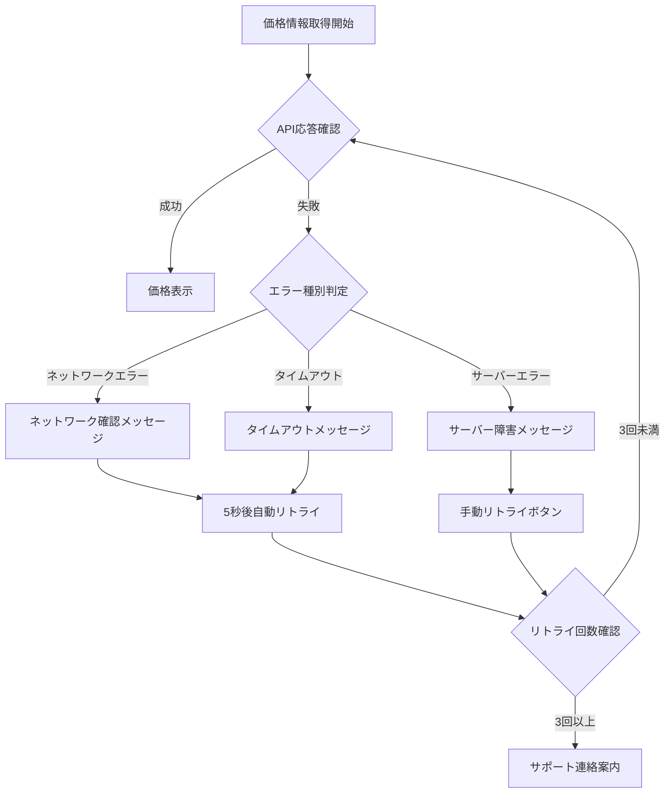
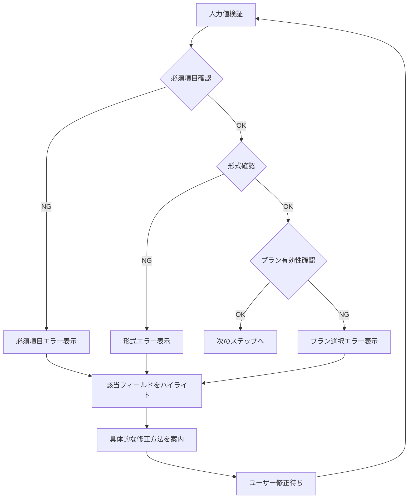
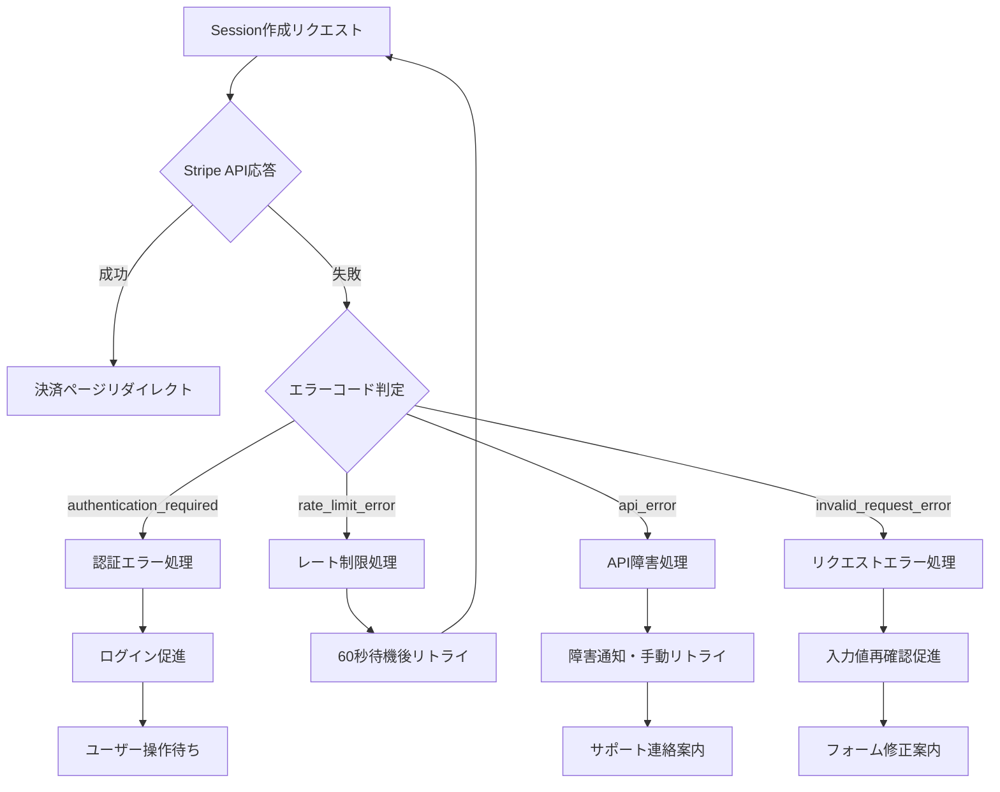
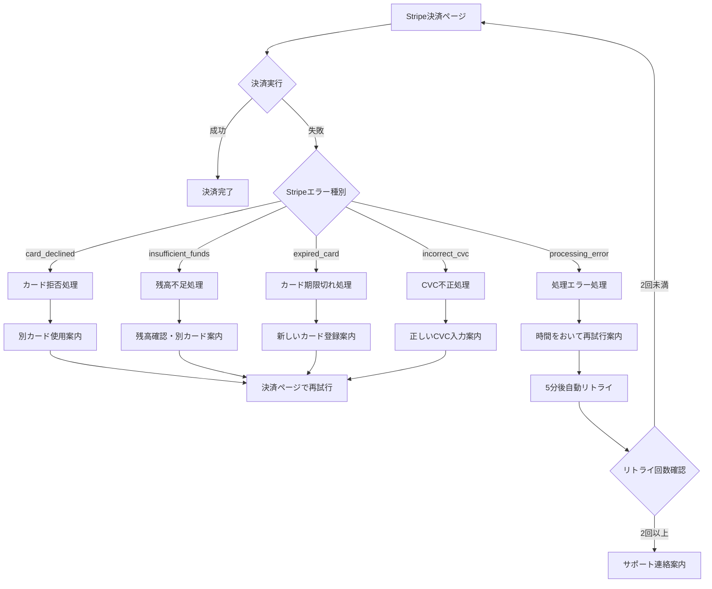
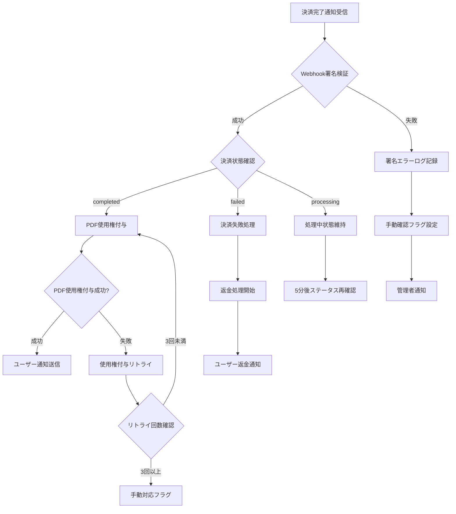
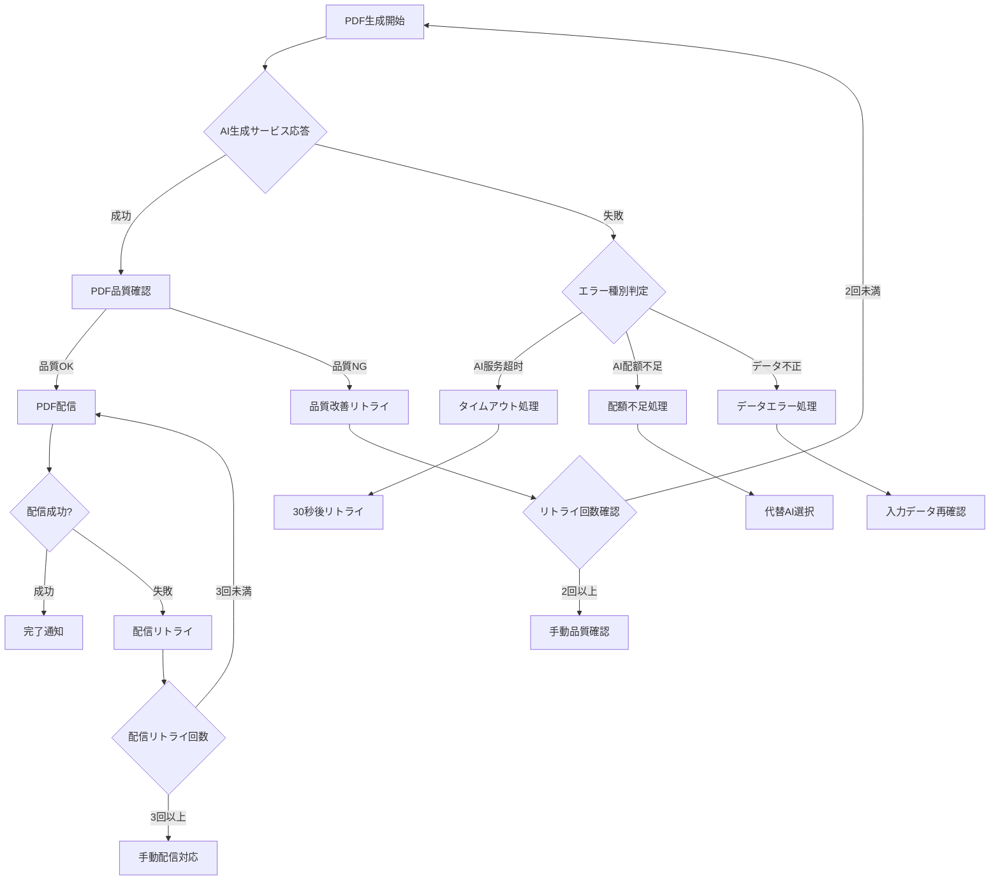
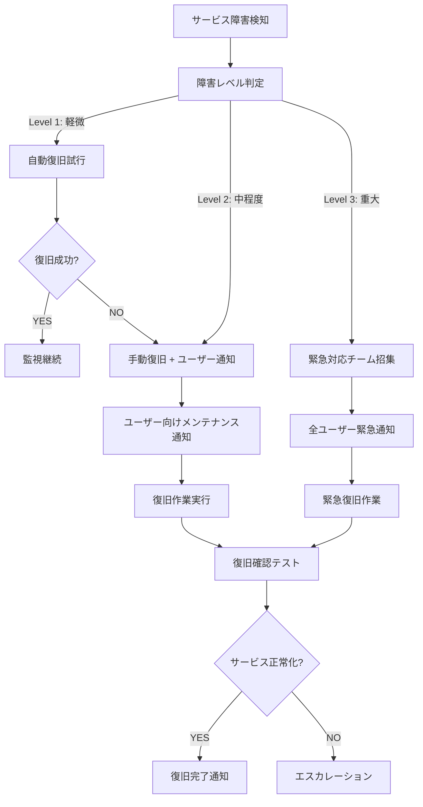
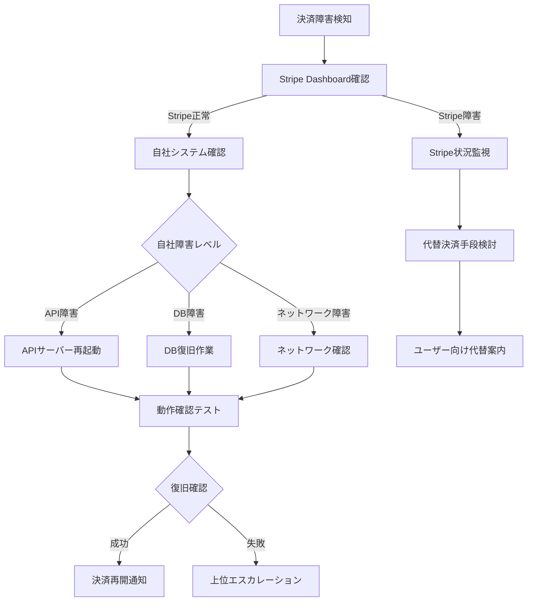

# 決済エラー処理フローチャート

**作成日**: 2025-06-20  
**作成者**: チームA（課金・決済担当）  
**バージョン**: 1.0  
**対象**: フロントエンド開発者、サポート担当者

---

## 📋 概要

AI補助金申請システムの決済プロセスで発生する可能性のあるエラーと、その対処法を体系化したフローチャートです。ユーザーファーストの観点から、分かりやすく親切な案内を心がけています。

---

## 🔄 メイン決済フロー

```
[決済開始] → [価格情報取得] → [Checkout Session作成] → [Stripe決済ページ] → [決済完了] → [PDF生成・配信]
     ↓              ↓                   ↓                    ↓               ↓              ↓
  [エラーA]      [エラーB]           [エラーC]           [エラーD]      [エラーE]       [エラーF]
```

---

## 📊 エラー分類と対処フロー

### エラーA: 価格情報取得エラー



**ユーザー向けメッセージ**:
- ネットワークエラー: "インターネット接続を確認して、再度お試しください"
- サーバーエラー: "一時的な障害が発生しています。しばらく時間をおいて再度お試しください"
- タイムアウト: "応答に時間がかかっています。もう一度お試しください"

### エラーB: バリデーションエラー



**具体的なエラーメッセージ例**:
```typescript
const validationErrors = {
  pdf_id: "PDFを選択してください",
  plan: "価格プランを選択してください", 
  success_url: "有効なURLを入力してください",
  email: "有効なメールアドレスを入力してください"
};
```

### エラーC: Checkout Session作成エラー



### エラーD: 決済処理エラー（Stripe側）



**決済エラーメッセージ例**:
```typescript
const stripeErrorMessages = {
  card_declined: {
    title: "カードが利用できませんでした",
    message: "お使いのカードで決済ができませんでした。別のカードをお試しいただくか、カード会社にお問い合わせください。",
    actions: ["別のカードを試す", "カード会社に連絡", "サポートに連絡"]
  },
  insufficient_funds: {
    title: "残高不足です", 
    message: "カードの利用限度額を超えているか、残高が不足しています。",
    actions: ["残高を確認", "別のカードを試す", "利用限度額を確認"]
  }
};
```

### エラーE: 決済完了後のWebhookエラー



### エラーF: PDF生成・配信エラー



---

## 🚨 緊急時対応フロー

### サービス全体障害



### 決済システム障害



---

## 📱 フロントエンド実装ガイド

### エラーUI設計方針

1. **分かりやすさ優先**
   - 技術用語を避ける
   - 具体的な対処法を提示
   - 次のアクションを明確に

2. **親切な案内**
   - 謝罪の気持ちを表現
   - 代替手段を提示
   - サポート連絡先を明記

3. **視覚的配慮**
   - エラーレベルに応じた色分け
   - アイコンで直感的に理解
   - 進捗状況の可視化

### エラーコンポーネント例

```typescript
interface ErrorDisplayProps {
  type: 'warning' | 'error' | 'info';
  title: string;
  message: string;
  actions?: Array<{
    label: string;
    onClick: () => void;
    primary?: boolean;
  }>;
  supportContact?: boolean;
}

const ErrorDisplay: React.FC<ErrorDisplayProps> = ({
  type, title, message, actions, supportContact
}) => {
  return (
    <div className={`error-display error-${type}`}>
      <div className="error-icon">
        {type === 'error' && <ErrorIcon />}
        {type === 'warning' && <WarningIcon />}
        {type === 'info' && <InfoIcon />}
      </div>
      
      <div className="error-content">
        <h3 className="error-title">{title}</h3>
        <p className="error-message">{message}</p>
        
        {actions && (
          <div className="error-actions">
            {actions.map((action, index) => (
              <button
                key={index}
                onClick={action.onClick}
                className={`btn ${action.primary ? 'btn-primary' : 'btn-secondary'}`}
              >
                {action.label}
              </button>
            ))}
          </div>
        )}
        
        {supportContact && (
          <div className="error-support">
            <p>お困りの場合は<a href="/support">サポート</a>までお気軽にお問い合わせください。</p>
          </div>
        )}
      </div>
    </div>
  );
};
```

### 自動リトライ実装例

```typescript
class PaymentRetryManager {
  private maxRetries = 3;
  private retryDelay = 1000; // 1秒
  
  async executeWithRetry<T>(
    operation: () => Promise<T>,
    errorHandler?: (error: Error, attempt: number) => void
  ): Promise<T> {
    let lastError: Error;
    
    for (let attempt = 1; attempt <= this.maxRetries; attempt++) {
      try {
        return await operation();
      } catch (error) {
        lastError = error as Error;
        
        if (errorHandler) {
          errorHandler(lastError, attempt);
        }
        
        if (attempt < this.maxRetries) {
          await this.delay(this.retryDelay * attempt);
        }
      }
    }
    
    throw lastError!;
  }
  
  private delay(ms: number): Promise<void> {
    return new Promise(resolve => setTimeout(resolve, ms));
  }
}
```

---

## 📊 エラー監視・分析

### 主要メトリクス

1. **エラー率**
   - 決済成功率: 目標 99.5%以上
   - API応答率: 目標 99.9%以上
   - PDF生成成功率: 目標 99.8%以上

2. **レスポンス時間**
   - 価格取得: 100ms以下
   - Session作成: 500ms以下
   - PDF生成: 30秒以下

3. **ユーザー体験**
   - 離脱率: 5%以下
   - 再試行率: 80%以上
   - サポート問い合わせ率: 1%以下

### アラート設定

```yaml
alerts:
  payment_success_rate:
    threshold: 95%
    window: 5m
    action: immediate_notification
    
  api_error_rate:
    threshold: 1%
    window: 1m
    action: warning_notification
    
  pdf_generation_timeout:
    threshold: 30s
    window: 1m
    action: investigation_required
```

---

## 📞 サポートエスカレーション

### レベル1: 自動対応
- 自動リトライ
- 代替手段の提示
- FAQ案内

### レベル2: サポート対応
- チャットサポート
- メールサポート
- 電話サポート（緊急時）

### レベル3: 技術チーム対応
- システム障害
- データ不整合
- セキュリティインシデント

### エスカレーション基準

```typescript
const escalationRules = {
  level1: {
    conditions: ['standard_error', 'retry_possible'],
    response: 'automated_recovery'
  },
  level2: {
    conditions: ['user_frustration', 'multiple_failures'],
    response: 'human_support'
  },
  level3: {
    conditions: ['system_wide_impact', 'security_concern'],
    response: 'technical_team'
  }
};
```

---

**最終更新**: 2025-06-20  
**次回レビュー**: 2025-06-27  
**承認者**: チームAリーダー