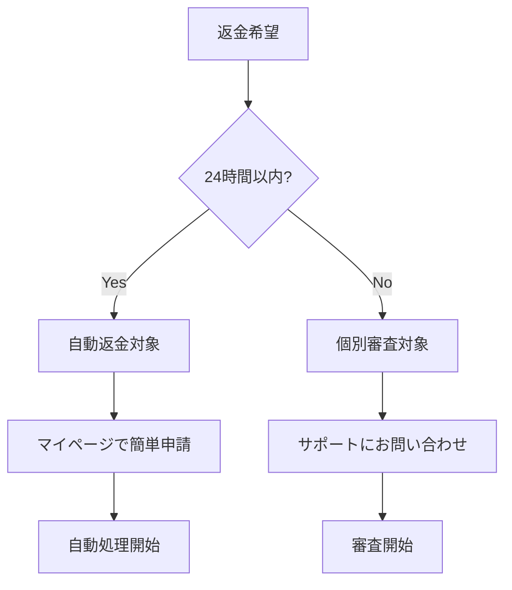
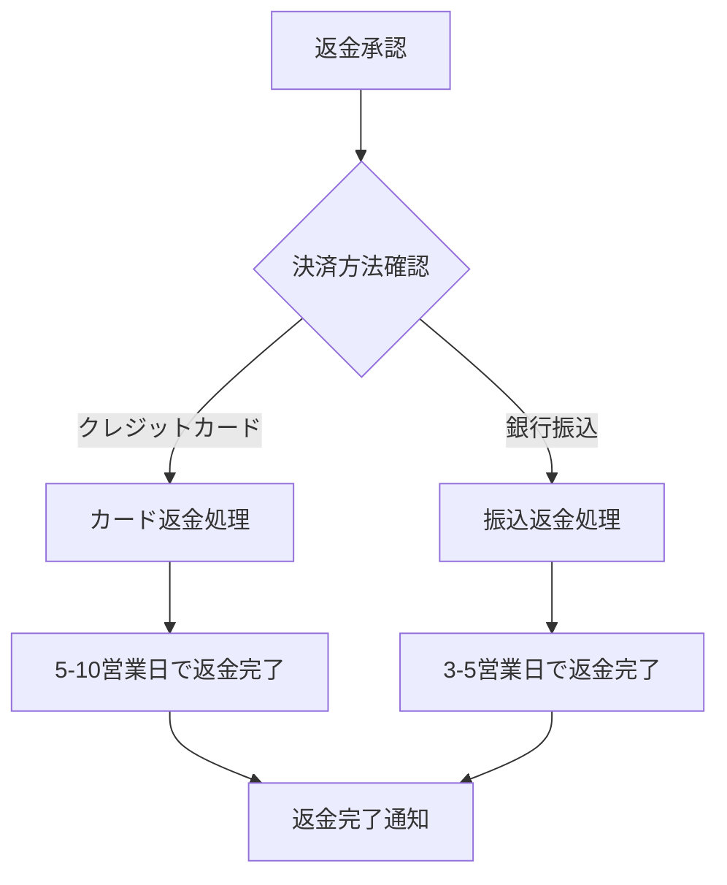
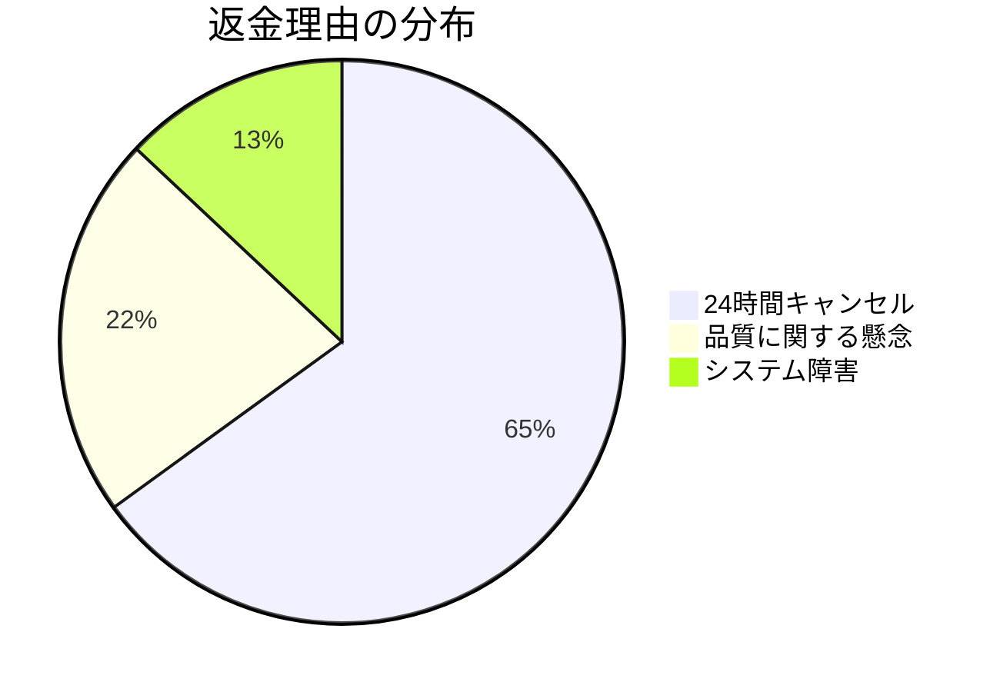

# 返金ポリシー

**作成日**: 2025-06-20  
**作成者**: チームA（課金・決済担当）  
**バージョン**: 1.0  
**適用開始**: 2025-06-20

---

## 📋 基本方針

AI補助金申請システムでは、**ユーザーファースト**の理念に基づき、公正で分かりやすい返金ポリシーを提供いたします。お客様の満足と信頼を最優先に、透明性の高い返金制度を運用しています。

### 基本理念
- 🤝 **お客様第一**: ユーザーの立場に立った柔軟な対応
- 🔍 **透明性**: 明確で分かりやすい基準・手続き
- ⚡ **迅速性**: 可能な限り速やかな対応
- 🛡️ **保護**: 不当な不利益からユーザーを守る

---

## ✅ 返金対象・条件

### 1. 無条件返金（24時間以内）

**対象**: 決済完了から24時間以内のキャンセル  
**条件**: 理由を問わず、無条件で全額返金いたします

| 項目 | 詳細 |
|------|------|
| 期限 | 決済完了から24時間以内 |
| 対象商品 | 全ての単発決済商品 |
| 返金額 | 決済金額の100% |
| 処理期間 | 即座に処理開始、5-10営業日で完了 |
| 手数料 | なし（当社負担） |

**手続き方法**:
1. マイページの「決済履歴」から対象の決済を選択
2. 「キャンセル」ボタンをクリック
3. 簡単なアンケート（任意）に回答
4. 返金処理が自動で開始されます

### 2. 品質保証返金

**対象**: PDF品質に重大な問題がある場合  
**条件**: 以下の品質基準を満たさない場合

| 品質基準 | 詳細 |
|----------|------|
| 文字化け・表示エラー | PDF内のテキストが正常に表示されない |
| 内容の重大な誤り | 明らかな事実誤認や論理的矛盾 |
| 申請要件との不整合 | 指定した補助金の要件に明確に適合しない |
| システムエラー | 生成処理中のシステム障害による不完全な成果物 |

**返金率**: 問題の程度に応じて50%-100%

### 3. システム障害返金

**対象**: 当社システムの障害により正常なサービス提供ができなかった場合

| 障害レベル | 返金率 | 対象期間 |
|------------|--------|----------|
| 軽微な障害 | 10% | サービス影響期間 |
| 中程度の障害 | 50% | サービス影響期間 |
| 重大な障害 | 100% | サービス影響期間 |

**自動返金**: システムで障害を検知した場合、自動で返金処理を開始します

---

## ❌ 返金対象外

以下の場合は返金の対象外となります：

### 1. 通常の利用範囲内
- 24時間経過後の単純な心変わり
- 実際に受け取ったサービスの価値に対する主観的不満
- 補助金の不採択（当社は採択を保証するものではありません）

### 2. ユーザー側の事情
- 入力情報の誤り・不備による成果物の問題
- ユーザー環境（ブラウザ、ネットワーク等）起因の問題
- 第三者による不正利用

### 3. 利用規約違反
- 商用転売、不正利用
- システムへの攻撃行為
- 著作権侵害その他法令違反

---

## 🔄 返金手続きフロー

### ステップ1: 返金申請



**申請方法**:
1. **24時間以内**: マイページから1クリック申請
2. **24時間経過後**: サポートフォーム、または電話でご相談

### ステップ2: 審査プロセス（個別審査の場合）

| 段階 | 期間 | 内容 |
|------|------|------|
| 初期確認 | 1営業日 | 申請内容の確認、システムログ調査 |
| 詳細審査 | 2-3営業日 | 品質確認、技術的検証 |
| 判定 | 1営業日 | 返金可否、金額の決定 |
| 通知 | 即日 | 結果をメール・システムで通知 |

### ステップ3: 返金実行



---

## 🏃‍♂️ 迅速返金システム

### 自動返金機能

**24時間キャンセル**: システムが自動で判定・処理
```typescript
// 自動返金の条件判定
const canAutoRefund = (payment: PaymentSession): boolean => {
  const now = new Date();
  const paymentTime = payment.completedAt;
  const hoursSincePayment = (now.getTime() - paymentTime.getTime()) / (1000 * 60 * 60);
  
  return hoursSincePayment <= 24 && payment.status === 'COMPLETED';
};
```

**システム障害時**: 障害検知と同時に自動返金
```typescript
// システム障害時の自動返金
const handleSystemFailure = async (severity: 'minor' | 'major' | 'critical') => {
  const refundRate = { minor: 0.1, major: 0.5, critical: 1.0 }[severity];
  
  // 影響を受けたユーザーに自動返金
  await processAutoRefunds(affectedUsers, refundRate);
};
```

### 返金スピード目標

| 返金種別 | 目標処理時間 | 実際の返金時期 |
|----------|-------------|---------------|
| 24時間キャンセル | 即座に処理開始 | 5-10営業日 |
| システム障害 | 障害解決後24時間以内 | 3-7営業日 |
| 品質問題 | 審査完了後即日 | 5-10営業日 |

---

## 💰 返金パターン・計算方法

### 1. 全額返金パターン

**適用ケース**:
- 24時間以内のキャンセル
- 重大なシステム障害
- 重大な品質問題

**計算例**:
```
決済金額: ¥3,980
返金額: ¥3,980（100%）
手数料: ¥0（当社負担）
ユーザー受取額: ¥3,980
```

### 2. 部分返金パターン

**適用ケース**:
- 軽微な品質問題
- 一部のサービス障害
- 特殊事情による個別判定

**計算例**:
```
決済金額: ¥3,980
問題の影響度: 30%
返金額: ¥1,194（30%）
ユーザー受取額: ¥1,194
```

### 3. サブスクリプション返金

**月額プランの場合**:
```
月額料金: ¥9,800
利用日数: 10日
未利用日数: 20日
日割り返金額: ¥6,533
```

**年額プランの場合**:
```
年額料金: ¥98,000
利用月数: 3か月
未利用月数: 9か月
月割り返金額: ¥73,500
```

---

## 📞 返金サポート

### お問い合わせ方法

#### 1. オンライン申請（推奨）
- **24時間キャンセル**: マイページから1クリック
- **その他**: サポートフォームから詳細記入

#### 2. メールサポート
- **アドレス**: refund@ai-subsidy.com
- **対応時間**: 平日9:00-18:00
- **応答目標**: 1営業日以内

#### 3. 電話サポート（緊急時）
- **番号**: 03-XXXX-XXXX
- **対応時間**: 平日10:00-17:00
- **対象**: 高額案件、特殊事情

### サポート品質保証

| 指標 | 目標値 | 測定方法 |
|------|--------|----------|
| 初回応答時間 | 1営業日以内 | システム自動測定 |
| 解決時間 | 3営業日以内 | ケース管理システム |
| 顧客満足度 | 4.5/5.0以上 | 解決後アンケート |
| 解決率 | 95%以上 | 月次レポート |

---

## 📊 返金実績・透明性レポート

### 月次返金統計（公開予定）

```
2025年6月実績:
├── 総決済件数: 1,234件
├── 返金件数: 23件（1.9%）
├── 24時間キャンセル: 15件（65%）
├── 品質問題: 5件（22%）
├── システム障害: 3件（13%）
└── 平均返金処理時間: 2.3営業日
```

### 返金理由分析



---

## 🔄 継続的改善

### フィードバック活用

**返金時アンケート**:
1. 返金理由の詳細
2. サービス改善への提案
3. 今後の利用意向
4. サポート対応の評価

**改善アクション例**:
- 品質問題 → AI モデルの改善
- UI/UX問題 → インターフェース改善
- 情報不足 → 説明の充実化

### ポリシー見直し

**見直し頻度**: 四半期ごと  
**見直し観点**:
- ユーザーフィードバック
- 業界ベストプラクティス
- 法令・規制の変更
- サービス内容の変更

---

## ⚖️ 法的事項

### 準拠法・管轄

**準拠法**: 日本国法  
**管轄裁判所**: 東京地方裁判所

### 消費者保護

**特定商取引法**: 適用される場合はクーリングオフ制度を適用  
**消費者契約法**: 消費者に不当に不利な条項は無効

### 個人情報保護

**返金処理データ**: 個人情報保護法に基づき適切に管理  
**保存期間**: 税法・商法に基づき7年間

---

## 📝 よくある質問（FAQ）

### Q1: 24時間キャンセルの「24時間」はいつから計算しますか？

**A**: 決済完了（Stripe決済成功）の時刻から24時間です。決済完了時に送信される確認メールに正確な時刻が記載されています。

### Q2: PDFをダウンロードした後でも返金できますか？

**A**: はい。24時間以内であれば、ダウンロード済みでも無条件で返金いたします。品質に問題がある場合は、24時間経過後でも返金対象となります。

### Q3: 返金処理中にPDFは使用できますか？

**A**: 返金処理開始と同時にPDFへのアクセスは停止されます。ただし、部分返金の場合は継続してご利用いただけます。

### Q4: クレジットカードが無効になっている場合の返金は？

**A**: 銀行振込での返金となります。振込手数料は当社負担いたします。

### Q5: 法人での支払いの場合、返金処理は異なりますか？

**A**: 基本的に同じですが、経理処理の都合により返金タイミングをご相談いただけます。

### Q6: 返金が拒否された場合の異議申し立ては？

**A**: サポートにご連絡ください。上級スタッフによる再審査を行います。それでも解決しない場合は、第三者機関での調停も可能です。

---

## 📞 お問い合わせ

**返金専用窓口**:
- 📧 Email: refund@ai-subsidy.com
- 📞 Phone: 03-XXXX-XXXX（平日10:00-17:00）
- 💬 Chat: サイト内チャットサポート（24時間）

**一般的なご質問**:
- 📧 Email: support@ai-subsidy.com
- 🌐 Web: https://ai-subsidy.com/support

---

**最終更新**: 2025-06-20  
**次回見直し**: 2025-09-20  
**承認者**: チームAリーダー・法務担当者

---

> 💡 **ユーザーへのメッセージ**  
> 私たちはお客様の満足を第一に考え、公正で透明性の高い返金制度を提供しています。ご不明な点やご心配事がございましたら、お気軽にサポートまでお問い合わせください。皆様に安心してサービスをご利用いただけるよう、今後も改善を続けてまいります。