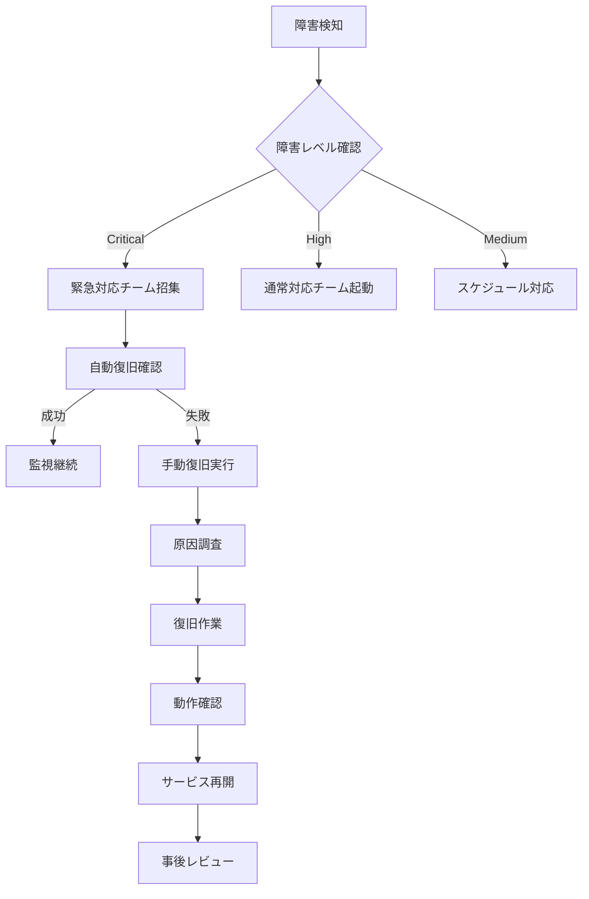

# 災害復旧計画書 (Disaster Recovery Plan)

**作成日**: 2025-06-20  
**作成者**: チームD (インフラ・監視担当)  
**対象システム**: AI補助金申請システム決済基盤  
**文書バージョン**: 1.0  
**適用範囲**: ハイブリッド課金モデル実装  

---

## 📋 目次

1. [概要](#概要)
2. [RTO/RPO目標](#rtorpo目標)
3. [復旧シナリオ](#復旧シナリオ)
4. [復旧手順](#復旧手順)
5. [テスト計画](#テスト計画)
6. [緊急連絡体制](#緊急連絡体制)

---

## 概要

### 目的
AI補助金申請システムの決済基盤における災害・障害発生時の迅速な復旧を実現し、ユーザーへの影響を最小限に抑える。

### 基本方針
- **ユーザーファースト**: 決済処理の中断時間を最小化
- **データ保護**: PCI DSS準拠のデータ保護を維持
- **透明性**: ユーザーへの迅速な状況報告
- **自動化**: 人的ミスを排除した自動復旧

### 適用システム
```yaml
対象システム:
  - 決済API (ECS Fargate)
  - データベース (RDS PostgreSQL Multi-AZ)
  - キャッシュ (ElastiCache Redis Cluster)
  - ロードバランサー (Application Load Balancer)
  - 監視システム (Prometheus/Grafana)
  - セキュリティ (WAF/GuardDuty)
```

---

## RTO/RPO目標

### 🎯 サービスレベル目標

| サービス | RTO | RPO | 可用性目標 | 重要度 |
|---------|-----|-----|-----------|--------|
| **決済API** | 5分 | 30秒 | 99.99% | Critical |
| **決済データベース** | 5分 | 30秒 | 99.99% | Critical |
| **セッション管理(Redis)** | 2分 | 1分 | 99.9% | High |
| **監視システム** | 10分 | 5分 | 99.5% | High |
| **WAF・セキュリティ** | 3分 | 1分 | 99.95% | Critical |
| **管理画面** | 30分 | 15分 | 99.0% | Medium |

### 📊 ビジネス影響度

```yaml
影響度レベル:
  Critical (RTO ≤ 5分):
    - 決済処理停止
    - 収益への直接影響
    - ユーザー体験の重大な悪化
    
  High (RTO ≤ 15分):
    - 一部機能の制限
    - 監視・ログ収集の停止
    - セキュリティ保護の低下
    
  Medium (RTO ≤ 30分):
    - 管理機能の停止
    - レポート生成の遅延
    - 開発・運用業務への影響
```

---

## 復旧シナリオ

### シナリオ1: 単一AZ障害

**影響範囲**: 1つのアベイラビリティゾーンの完全停止

**復旧戦略**:
```yaml
自動対応:
  - Multi-AZ構成による自動フェイルオーバー
  - Auto Scalingによる他AZでの自動拡張
  - ALBによる健全インスタンスへの自動ルーティング
  
実行時間: 30秒〜2分
ユーザー影響: 最小限（レスポンス時間の軽微な増加のみ）
```

**対応手順**:
1. **自動検知**: CloudWatch Alarmによる即座の検知
2. **自動復旧**: ALBが障害AZを切り離し
3. **スケーリング**: 残りAZでのリソース自動拡張
4. **監視**: 復旧状況の監視継続

### シナリオ2: データベース障害

**影響範囲**: プライマリデータベースの完全停止

**復旧戦略**:
```yaml
自動対応:
  - RDS Multi-AZによる自動フェイルオーバー
  - 読み取り専用レプリカの自動昇格
  - 接続プールの自動再設定
  
実行時間: 30秒〜1分
ユーザー影響: 決済処理の一時停止（最大1分）
```

**対応手順**:
1. **障害検知**: 30秒以内でのDB接続失敗検知
2. **自動フェイルオーバー**: RDSの自動フェイルオーバー実行
3. **接続回復**: アプリケーションの接続プール再構築
4. **データ整合性確認**: 決済データの整合性チェック

### シナリオ3: リージョン全体障害

**影響範囲**: プライマリリージョン (us-east-1) の完全停止

**復旧戦略**:
```yaml
手動対応が必要:
  - バックアップリージョン (us-west-2) への切り替え
  - DNSの手動変更
  - データベースリストアの実行
  
実行時間: 15分〜30分
ユーザー影響: サービス停止（復旧まで）
```

**対応手順**:
1. **障害確認**: リージョン全体の状況確認（5分以内）
2. **DR宣言**: 災害復旧モードの正式宣言
3. **DNS切り替え**: Route53による自動フェイルオーバー
4. **サービス起動**: バックアップリージョンでのサービス開始
5. **データ同期**: 最新バックアップからのデータリストア

### シナリオ4: アプリケーション障害

**影響範囲**: 決済アプリケーションのクラッシュ・無応答

**復旧戦略**:
```yaml
自動対応:
  - ECS Health Checkによる不健全タスクの自動置換
  - Auto Scalingによる新しいタスクの自動起動
  - ALBによる健全タスクへのルーティング
  
実行時間: 1分〜3分
ユーザー影響: 一時的なレスポンス遅延
```

**対応手順**:
1. **Health Check失敗**: ECSタスクのヘルスチェック失敗検知
2. **タスク終了**: 不健全タスクの自動終了
3. **新タスク起動**: 新しいタスクの自動起動
4. **ロードバランシング**: 健全タスクへのトラフィック集約

---

## 復旧手順

### 🚨 緊急時対応フロー



### 📝 詳細復旧手順

#### Step 1: 初期対応 (0-5分)

```bash
#!/bin/bash
# 緊急時初期確認スクリプト

echo "=== 災害復旧初期確認 ==="
echo "実行時刻: $(date)"

# 1. システム状況確認
echo "1. システム健全性チェック"
curl -f https://payments.ai-subsidy.com/health || echo "決済API: 停止"
curl -f https://api.ai-subsidy.com/health || echo "メインAPI: 停止"

# 2. データベース接続確認
echo "2. データベース接続確認"
psql -h $DB_ENDPOINT -U $DB_USER -d $DB_NAME -c "SELECT 1;" || echo "DB: 接続失敗"

# 3. Redis接続確認
echo "3. Redis接続確認"
redis-cli -h $REDIS_ENDPOINT ping || echo "Redis: 接続失敗"

# 4. AWS サービス状況確認
echo "4. AWS サービス状況"
aws elbv2 describe-target-health --target-group-arn $TG_ARN
aws ecs describe-services --cluster $CLUSTER_NAME --services $SERVICE_NAME

# 5. アラート状況確認
echo "5. 現在のアラート"
aws cloudwatch describe-alarms --state-value ALARM
```

#### Step 2: 自動復旧確認 (5-10分)

```yaml
自動復旧チェックリスト:
  ✓ Auto Scaling: 新しいインスタンス起動確認
  ✓ Health Check: ALBターゲット健全性確認
  ✓ Database Failover: Multi-AZ自動切り替え確認
  ✓ DNS Resolution: Route53健全性確認
  ✓ Security: WAF・セキュリティグループ正常性
```

#### Step 3: 手動復旧 (10-30分)

```bash
#!/bin/bash
# 手動復旧スクリプト

case "$FAILURE_TYPE" in
  "database")
    echo "データベース手動復旧開始"
    # RDS手動フェイルオーバー
    aws rds failover-db-cluster --db-cluster-identifier $CLUSTER_ID
    ;;
    
  "application")
    echo "アプリケーション手動復旧開始"
    # ECSサービス強制更新
    aws ecs update-service --cluster $CLUSTER_NAME --service $SERVICE_NAME --force-new-deployment
    ;;
    
  "regional")
    echo "リージョナル復旧開始"
    # DNS切り替え
    aws route53 change-resource-record-sets --hosted-zone-id $ZONE_ID --change-batch file://failover-dns.json
    # バックアップリージョンでサービス起動
    terraform apply -var="region=us-west-2" -var="disaster_recovery=true"
    ;;
esac
```

#### Step 4: 動作確認 (5-10分)

```bash
#!/bin/bash
# 復旧後動作確認スクリプト

echo "=== 復旧後動作確認 ==="

# 1. エンドツーエンドテスト
echo "1. 決済API動作確認"
curl -X POST https://payments.ai-subsidy.com/api/test-payment \
  -H "Content-Type: application/json" \
  -d '{"amount": 100, "currency": "jpy", "test": true}'

# 2. データベース整合性確認
echo "2. データ整合性確認"
psql -h $DB_ENDPOINT -U $DB_USER -d $DB_NAME -c "
  SELECT COUNT(*) as total_payments,
         COUNT(CASE WHEN status = 'completed' THEN 1 END) as completed_payments
  FROM payments WHERE created_at > NOW() - INTERVAL '1 hour';"

# 3. 監視システム確認
echo "3. 監視システム動作確認"
curl -f http://prometheus:9090/-/healthy
curl -f http://grafana:3000/api/health

# 4. パフォーマンステスト
echo "4. パフォーマンステスト"
ab -n 100 -c 10 https://payments.ai-subsidy.com/api/health
```

---

## テスト計画

### 🧪 災害復旧テストスケジュール

| テスト種別 | 頻度 | 実施時期 | 対象範囲 | 期待時間 |
|-----------|------|----------|----------|----------|
| **自動フェイルオーバーテスト** | 月次 | 毎月第2土曜日 2:00AM | 単一AZ障害 | 2分以内 |
| **データベースフェイルオーバー** | 四半期 | 3,6,9,12月 | RDS Multi-AZ | 1分以内 |
| **リージョン間DR訓練** | 半期 | 6月, 12月 | 全システム | 30分以内 |
| **アプリケーション復旧訓練** | 月次 | 毎月第4土曜日 | ECS/Fargate | 3分以内 |

### 📋 テスト手順例

#### 月次フェイルオーバーテスト

```bash
#!/bin/bash
# 月次災害復旧テスト実行スクリプト

TEST_DATE=$(date +%Y%m%d)
LOG_FILE="/var/log/dr-test-${TEST_DATE}.log"

echo "=== 災害復旧テスト開始: $TEST_DATE ===" | tee -a $LOG_FILE

# 1. 事前状況記録
echo "事前状況記録" | tee -a $LOG_FILE
BEFORE_STATUS=$(curl -s https://payments.ai-subsidy.com/health)
echo "決済API状況: $BEFORE_STATUS" | tee -a $LOG_FILE

# 2. 人為的障害導入
echo "AZ障害シミュレーション開始" | tee -a $LOG_FILE
START_TIME=$(date +%s)

# 特定AZのインスタンスを一時停止
aws ec2 stop-instances --instance-ids $(aws ec2 describe-instances \
  --filters "Name=tag:Environment,Values=prod" "Name=availability-zone,Values=us-east-1a" \
  --query "Reservations[].Instances[].InstanceId" --output text)

# 3. 復旧時間測定
echo "復旧状況監視" | tee -a $LOG_FILE
while true; do
  CURRENT_TIME=$(date +%s)
  ELAPSED=$((CURRENT_TIME - START_TIME))
  
  if curl -f https://payments.ai-subsidy.com/health; then
    echo "復旧完了: ${ELAPSED}秒" | tee -a $LOG_FILE
    break
  fi
  
  if [ $ELAPSED -gt 300 ]; then
    echo "復旧失敗: 5分以内に復旧できませんでした" | tee -a $LOG_FILE
    break
  fi
  
  sleep 10
done

# 4. テスト結果記録
echo "=== テスト完了 ===" | tee -a $LOG_FILE
```

---

## 緊急連絡体制

### 📞 エスカレーション体制

```yaml
緊急連絡体制:
  Level 1 - 初期対応 (0-5分):
    担当: オンコールエンジニア
    連絡先: +81-90-XXXX-XXXX
    Slack: #team-d-oncall
    
  Level 2 - エスカレーション (5-15分):
    担当: チームDリーダー
    連絡先: +81-90-YYYY-YYYY
    Email: team-d-leader@ai-subsidy.com
    
  Level 3 - 重大インシデント (15分以上):
    担当: CTOおよび経営陣
    連絡先: emergency@ai-subsidy.com
    SMS: 緊急時一斉配信リスト
```

### 🚨 アラート設定

```yaml
アラート通知レベル:
  Critical (即座):
    - 決済API完全停止
    - データベース接続失敗
    - セキュリティ侵害検知
    → PagerDuty + 電話 + SMS
    
  High (2分以内):
    - パフォーマンス劣化
    - 一部機能停止
    - 高いエラー率
    → Slack + Email
    
  Warning (5分以内):
    - リソース使用率上昇
    - ログ異常検知
    → Slack通知のみ
```

### 📱 連絡ツール

```yaml
使用ツール:
  - PagerDuty: Critical緊急通知
  - Slack: #incident-response チャンネル
  - Zoom: 緊急会議ルーム (常時開設)
  - StatusPage: ユーザー向け状況報告
  - Email: team-d@ai-subsidy.com
```

---

## 📊 復旧状況報告

### ユーザー向け状況報告

```yaml
報告タイミング:
  障害検知後: 15分以内
  復旧作業中: 30分ごと
  復旧完了後: 即座
  事後報告: 24時間以内

報告チャンネル:
  - システム内通知
  - StatusPageでの状況更新  
  - Twitter: @ai_subsidy_status
  - Email: 影響のあるユーザーのみ
```

### 事後分析・改善

```yaml
必須レビュー項目:
  - 障害原因の根本分析
  - 復旧時間の妥当性評価
  - ユーザー影響度の測定
  - 改善アクションの策定
  - 再発防止策の実装
  
レビュー完了期限: 障害復旧後1週間以内
```

---

**このドキュメントは生きた文書です。システムの変更に応じて定期的に更新し、実際の災害復旧能力を維持します。**

**最終更新**: 2025-06-20  
**次回レビュー予定**: 2025-07-20  
**承認者**: チームDリーダー