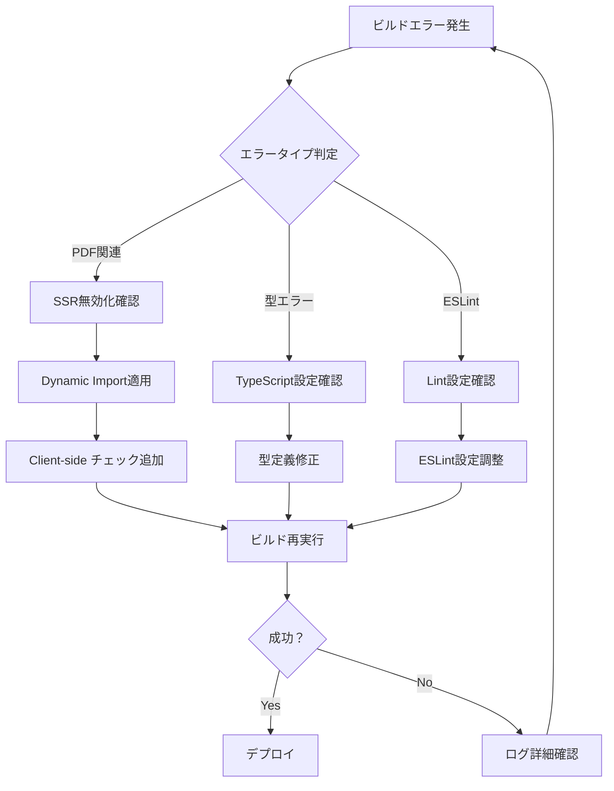

# ビルドエラー回避のための開発ガイドライン

## 🚨 主要なビルドエラーとその対策

### 1. PDF関連ライブラリのSSRエラー

**エラー例:**
```
Error [ERR_MODULE_NOT_FOUND]: Cannot find module '/Users/.../node_modules/fontkit/node_modules/@swc/helpers/esm/_define_property.js'
```

**原因:**
- `pdf-lib`, `@react-pdf/renderer`, `fontkit`などがサーバーサイドで実行される
- Next.jsのSSR（Server-Side Rendering）で Node.js 環境にないブラウザAPIを使用

**対策:**
1. **Next.js設定での制御** (`next.config.js`)
2. **Dynamic Import の使用**
3. **クライアントサイド専用コンポーネント**

### 2. 開発ルール

#### ❌ やってはいけないこと
```typescript
// 直接インポート（SSRエラーの原因）
import { PDFDocument } from 'pdf-lib';
import { PDFDownloadLink } from '@react-pdf/renderer';

// サーバーコンポーネントでPDF操作
export default function ServerComponent() {
  const pdf = PDFDocument.create(); // エラー！
}
```

#### ✅ 正しい方法
```typescript
// Dynamic Import
import dynamic from 'next/dynamic';

const PDFComponent = dynamic(() => import('./PDFComponent'), {
  ssr: false, // SSRを無効化
  loading: () => <div>PDF読み込み中...</div>
});

// クライアントサイド専用
'use client';
import { useEffect, useState } from 'react';

export default function ClientPDFComponent() {
  const [pdfLib, setPdfLib] = useState(null);
  
  useEffect(() => {
    // ブラウザ環境でのみ実行
    if (typeof window !== 'undefined') {
      import('pdf-lib').then(setPdfLib);
    }
  }, []);
}
```

### 3. コンポーネント作成時のチェックリスト

#### PDF関連コンポーネントを作成する場合：

- [ ] `'use client'` を先頭に記述
- [ ] `typeof window !== 'undefined'` でブラウザ環境をチェック
- [ ] PDF関連ライブラリは `dynamic import` で読み込み
- [ ] エラーハンドリングを実装
- [ ] Loading状態を表示

#### ビルド前の確認事項：

- [ ] `npm run build` でローカルビルドテスト
- [ ] PDF関連機能が含まれるページのプリレンダリング確認
- [ ] TypeScriptエラーがないことを確認
- [ ] ESLintエラーがないことを確認

### 4. 推奨されるファイル構造

```
src/
├── components/
│   ├── ui/
│   │   └── SafePDFButton.tsx        # 安全なPDFボタン
│   └── pdf/
│       ├── PDFViewer.tsx            # クライアント専用
│       └── PDFGenerator.tsx         # クライアント専用
├── utils/
│   ├── pdf-client-only.ts           # クライアント専用PDF処理
│   └── pdf-server-safe.ts           # サーバー安全な代替処理
└── hooks/
    └── usePDFGeneration.ts           # PDFフック
```

### 5. Next.js設定（next.config.js）

```javascript
const nextConfig = {
  webpack: (config, { isServer }) => {
    // クライアントサイドのfallback設定
    if (!isServer) {
      config.resolve.fallback = {
        ...config.resolve.fallback,
        canvas: false,
        fs: false,
        net: false,
        tls: false,
        child_process: false,
      };
    }

    // サーバーサイドでPDF関連ライブラリを除外
    if (isServer) {
      config.externals.push(
        'pdf-lib',
        '@react-pdf/renderer',
        'fontkit',
        'pdfjs-dist'
      );
    }

    return config;
  },
};
```

### 6. エラー対応フロー



### 7. 緊急時の対応

#### ビルドエラーが解決しない場合：

1. **一時的な回避策**
   ```typescript
   // 一時的にコンポーネントを無効化
   if (process.env.NODE_ENV === 'production') {
     return <div>PDF機能は準備中です</div>;
   }
   ```

2. **フォールバック実装**
   ```typescript
   // 代替案の提供
   const PDFDownloadButton = dynamic(
     () => import('./SafePDFButton'),
     {
       ssr: false,
       loading: () => <Button disabled>PDF準備中...</Button>
     }
   );
   ```

3. **段階的修正**
   - 問題のあるコンポーネントを一時的に削除
   - ビルド成功後、段階的に機能を復元
   - 各段階でビルドテストを実施

### 8. 継続的な品質保証

#### 開発時のワークフロー：

1. **機能開発**
   - PDF関連機能は最初からクライアント専用で実装
   - 適切なエラーハンドリングを含める

2. **ローカルテスト**
   ```bash
   npm run build
   npm run start
   ```

3. **プッシュ前チェック**
   - ビルドエラーがないことを確認
   - PDF機能が正常動作することを確認

4. **CI/CDでの監視**
   - ビルド失敗時の自動通知
   - 段階的デプロイメント

## 🔧 トラブルシューティング

### よくあるエラーと解決法

| エラー | 原因 | 解決法 |
|--------|------|--------|
| `fontkit module not found` | SSR時のモジュール解決失敗 | Dynamic import + SSR無効化 |
| `canvas is not defined` | ブラウザAPIのサーバー実行 | Client-side チェック追加 |
| `Invalid border style` | @react-pdf/rendererの仕様 | borderWidth + borderStyle使用 |
| `PDF blob creation failed` | メモリ不足または権限 | ファイルサイズ制限 + エラーハンドリング |

この ガイドラインに従うことで、PDF関連のビルドエラーを確実に回避できます。